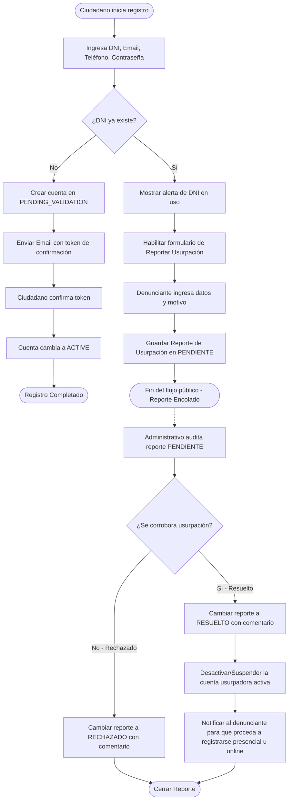

# Dominio de Identidad y Autenticación (`identity`)
> Sistema: **Turnero** — Municipalidad de Armstrong
> Tipo de Documento: Especificación Funcional por Dominio

Este dominio es responsable de la gestión de cuentas de usuario, el control de acceso basado en roles (RBAC), la autenticación segura y el protocolo de reporte y resolución de usurpaciones de identidad (DNI en uso).

---

## 1. Historias de Usuario Técnicas

- **HU-01** `USU-02` — *Como Ciudadano, quiero registrarme con DNI, email, teléfono y contraseña para acceder al sistema.*
  - **Criterios de Aceptación (CA):**
    - El formulario exige: DNI (número), Nombre, Apellido, Email, Teléfono de contacto y Contraseña.
    - El sistema valida que el DNI sea único y el Email sea único.
    - La contraseña debe cumplir con una política mínima de seguridad (ej: mínimo 8 caracteres, al menos una letra y un número).
    - Al registrarse, la cuenta se crea en estado `PENDING_VALIDATION` y se envía un token de confirmación de un solo uso por correo electrónico.
- **HU-02** — *Como Ciudadano o Administrativo, quiero iniciar y cerrar sesión de forma segura.*
  - **Criterios de Aceptación (CA):**
    - El inicio de sesión valida el email y la contraseña contra el hash almacenado en la base de datos (encriptación `bcrypt`).
    - Tras la autenticación exitosa, el servidor emite un JSON Web Token (JWT) de sesión.
    - En el frontend de Next.js, este JWT se almacena en una cookie segura con directivas `HttpOnly`, `Secure` y `SameSite=Strict` para evitar accesos desde JavaScript (prevención XSS).
    - El cierre de sesión (logout) invalida la cookie de sesión del navegador y revoca el token en el cliente.
- **HU-03** — *Como Ciudadano, quiero recuperar mi contraseña si la olvidé.*
  - **Criterios de Aceptación (CA):**
    - Permite solicitar el restablecimiento ingresando el Email registrado.
    - Si el correo existe, el sistema genera y envía un enlace de recuperación con un token de un solo uso que expira en 1 hora.
    - El enlace redirige al formulario de nueva contraseña, el cual debe validar las reglas de la política de contraseñas antes de actualizar el hash en base de datos.
- **HU-04** `USU-02` — *Como Ciudadano, quiero editar mis datos de contacto.*
  - **Criterios de Aceptación (CA):**
    - El ciudadano autenticado puede editar su Teléfono e Email desde su perfil.
    - Si el usuario modifica su Email, la cuenta vuelve a estado `PENDING_VALIDATION` y se le exige confirmar el nuevo correo mediante un enlace de validación enviado a la nueva dirección antes de poder reservar turnos nuevamente.
- **HU-23** `ADM-03` — *Como Administrador, quiero crear cuentas para usuarios administrativos.*
  - **Criterios de Aceptación (CA):**
    - Formulario de uso exclusivo del Administrador que requiere: Nombre, Apellido, Email y asignación del rol administrativo.
    - El sistema valida que el Email sea único. El sistema genera una contraseña temporal y la envía al correo electrónico del nuevo administrativo.
- **HU-24** `ADM-04` — *Como Administrador, quiero eliminar usuarios administrativos del sistema.*
  - **Criterios de Aceptación (CA):**
    - El Administrador puede dar de baja una cuenta administrativa.
    - La cuenta cambia a estado `INACTIVE` o se elimina lógicamente. Todos los tokens JWT activos para ese usuario son rechazados inmediatamente por el backend.
- **HU-27** — *Como Ciudadano no autenticado, quiero reportar una usurpación de DNI si el sistema me indica que mi DNI ya se encuentra en uso.*
  - **Criterios de Aceptación (CA):**
    - Si durante el registro de ciudadano se detecta que el DNI ingresado ya existe, el sistema muestra el enlace "Reportar usurpación".
    - Abre un formulario público que solicita: Nombre, Apellido, Email, Teléfono de contacto (del denunciante), DNI en conflicto (precargado y bloqueado) y un comentario con la justificación del reporte.
    - Al enviar, se guarda un registro en la tabla `reportes_usurpacion_dni` en estado `PENDIENTE`.
- **HU-28** — *Como Administrativo, quiero gestionar los reportes de usurpación de DNI.*
  - **Criterios de Aceptación (CA):**
    - El panel administrativo cuenta con una sección "Reportes de Identidad" que expone las denuncias.
    - El administrativo puede filtrar por estado (PENDIENTE, EN_PROCESO, RESUELTO, RECHAZADO).
    - Para resolver un reporte, el administrativo puede cambiar su estado e ingresar un comentario obligatorio de resolución (ej: indicando que se verificó la identidad de forma presencial).
    - El panel ofrece un botón de acceso directo al perfil de la cuenta activa que posee el DNI usurpado, con la opción rápida de suspenderla o desactivarla si se corrobora la usurpación.

---

## 2. Diagrama de Flujo de Registro y Gestión de Usurpación

El siguiente diagrama detalla la lógica de registro de ciudadanos, la ramificación ante colisión de DNI y el flujo de resolución de usurpación por parte del administrativo:

---

## 3. Reglas de Negocio del Dominio

1. **Autenticación Híbrida:**
   - La API del backend admite la autenticación a través de cabeceras `Authorization: Bearer <JWT>` (para testing de API o integraciones) y a través del parámetro de cookie `session_token` (canal principal del frontend).
2. **Acceso Único por DNI:**
   - El DNI es el identificador primario del ciudadano ante el municipio. No pueden existir dos cuentas activas con el mismo número de DNI.
3. **Flujo de Usurpación:**
   - El reporte de usurpación es anónimo en cuanto a credenciales (no requiere sesión iniciada), pero captura obligatoriamente datos de contacto del denunciante para auditoría presencial y offline.
   - Las cuentas suspendidas por usurpación cambian su estado a `INACTIVE` y no pueden reservar turnos ni iniciar sesión.
4. **Registro "Al Vuelo" por Administrativo:**
   - Cuando un administrativo registra a un ciudadano de forma manual desde el panel operativo (porque no tiene cuenta previa en el sistema), el backend crea la cuenta del ciudadano en estado `PENDING_VALIDATION`.
   - Se encola y despacha un correo electrónico de confirmación de registro de forma asíncrona. El ciudadano debe seguir el enlace de este correo para validar su cuenta, establecer su contraseña de acceso y pasar a estado `ACTIVE` antes de poder operar de forma autónoma en el portal web. La cuenta no le permite loguearse en la web hasta completar esta validación, aunque sus turnos reservados manualmente por el administrativo siguen siendo válidos en el sistema.
