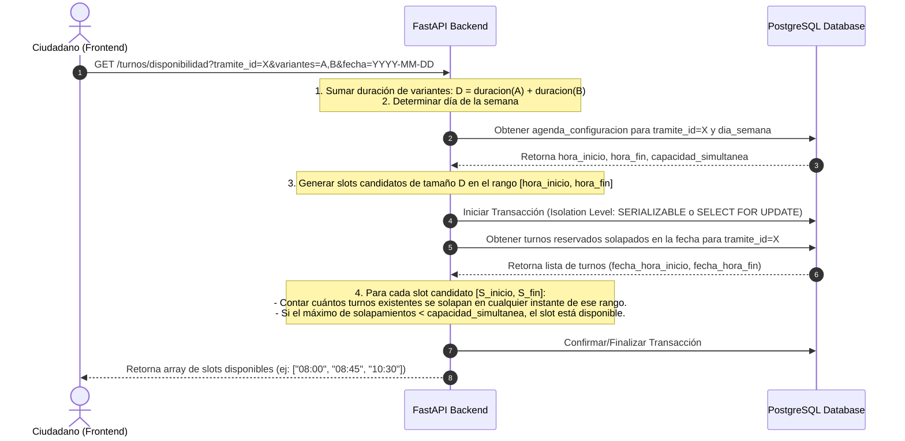
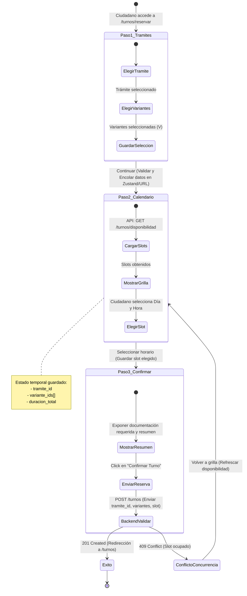

# Dominio de Reservas y Disponibilidad (`booking`)
> Sistema: **Turnero** — Municipalidad de Armstrong
> Tipo de Documento: Especificación Funcional por Dominio

Este dominio contiene el núcleo algorítmico y transaccional del sistema. Gestiona la consulta de disponibilidad horaria real, el carrito de variantes, las reglas de prevención de sobre-reservas y el ciclo de vida inicial del turno (reserva, reprogramación y cancelación).

---

## 1. Historias de Usuario Técnicas

- **HU-05** `USU-01` `USU-03` — *Como Ciudadano, quiero elegir turno primero por tipo de trámite y luego por variante.*
  - **Criterios de Aceptación (CA):**
    - Interfaz del Stepper de reserva en dos pasos: primero expone el listado de trámites; tras seleccionar uno, expone las variantes de ese trámite.
    - Se muestran los requerimientos previos y la documentación a llevar.
- **HU-06** `USU-04` — *Como Ciudadano, quiero seleccionar más de una variante en una misma solicitud.*
  - **Criterios de Aceptación (CA):**
    - El ciudadano puede marcar múltiples variantes de un mismo trámite (ej: "Examen Teórico" + "Examen Médico").
    - El sistema acumula las duraciones de las variantes elegidas para formar un bloque continuo único de atención.
- **HU-07** `USU-06` `USU-05` — *Como Ciudadano, quiero ver los turnos disponibles y elegir fecha y horario.*
  - **Criterios de Aceptación (CA):**
    - Muestra un calendario interactivo con días disponibles y una grilla con los horarios de inicio de slots libres calculados en tiempo real.
    - Bloquea optimistamente el slot seleccionado al avanzar al paso de confirmación.
- **HU-08** `USU-07` — *Como Ciudadano, quiero usar la opción rápida "primer turno disponible".*
  - **Criterios de Aceptación (CA):**
    - Un botón "Primer Turno Disponible" busca y asigna automáticamente la primera ranura libre en los próximos 30 días que cumpla con la duración total requerida.
- **HU-10** — *Como Ciudadano, quiero reprogramar un turno existente.*
  - **Criterios de Aceptación (CA):**
    - Permite cambiar el día y horario de un turno en estado `RESERVADO`.
    - La reprogramación se ejecuta de forma atómica: si la reserva del nuevo slot falla, el turno original no se libera.
    - Respeta la anticipación mínima de cancelación configurada.
- **HU-11** — *Como Ciudadano o Administrativo, quiero cancelar un turno que ya no necesito.*
  - **Criterios de Aceptación (CA):**
    - **Por el ciudadano:** Solo si faltan $\ge 24\text{ horas}$ (o el tiempo configurado globalmente) para el inicio del turno. Libera el cupo y el turno pasa a estado `CANCELADO`.
    - **Por el administrativo:** Puede cancelar en cualquier momento. El formulario le exige obligatoriamente ingresar un `motivo_cancelacion`. Se guarda quién canceló en `cancelado_por_id`.
- **HU-12** `USU-11` — *Como Ciudadano, quiero ver la lista de mis turnos reservados y mi historial.*
  - **Criterios de Aceptación (CA):**
    - Panel privado con pestañas: "Próximos turnos" e "Historial". Permite acceder al comprobante de reserva.
- **HU-15** `ADT-04` — *Como Administrativo, quiero cargar turnos manualmente (presencial, teléfono o WhatsApp).*
  - **Criterios de Aceptación (CA):**
    - Permite buscar un ciudadano por DNI. Si no existe, despliega campos mínimos para registrarlo simultáneamente (Nombre, Apellido, Email, Teléfono) y procede a agendar el turno.
    - Al crear el ciudadano al vuelo, el backend genera su cuenta en estado `PENDING_VALIDATION` y le envía un correo electrónico de confirmación para que cree su contraseña y active su cuenta de manera autónoma en el futuro (igualando el flujo del portal web).
- **HU-16** `ADT-05` — *Como Administrativo, quiero modificar los datos de cualquier turno existente en el sistema.*
  - **Criterios de Aceptación (CA):**
    - El administrativo puede reprogramar, cancelar o editar comentarios de cualquier turno registrado en cualquier área, sin la restricción de anticipación mínima del ciudadano.

---

## 2. Diagramas Técnicos y Algoritmos

### 2.1 Diagrama de Secuencia del Motor de Disponibilidad

### 2.2 Algoritmo de Cálculo de Duración y Solapamiento
Cuando un ciudadano selecciona múltiples variantes $V = \{v_1, v_2, \dots, v_n\}$ para un trámite en una sola solicitud, el sistema calculará un bloque de tiempo único y continuo en base a la suma de las duraciones individuales:
$$\text{duracion\_total} = \sum_{i=1}^{n} v_i.\text{duracion\_minutos}$$
El turno ocupará el rango `[fecha_hora_inicio, fecha_hora_inicio + duracion_total]`.

Dos turnos, $\text{Turno}_A$ y $\text{Turno}_B$, se superponen si:
$$\text{Turno}_A.\text{fecha\_hora\_inicio} < \text{Turno}_B.\text{fecha\_hora\_fin} \quad \land \quad \text{Turno}_B.\text{fecha\_hora\_inicio} < \text{Turno}_A.\text{fecha\_hora\_fin}$$

### 2.3 Algoritmo para "Primer Turno Disponible" (HU-08)
Este algoritmo permite encontrar la primera franja libre adecuada para la duración calculada $D$ de un trámite:
1. Definir una ventana de búsqueda de días que inicia en $\max(\text{ahora} + 2\text{ horas}, \text{mañana a las 00:00})$.
2. Iterar día por día hasta un máximo de 30 días en el futuro:
   - Obtener la configuración de la agenda para el día de la semana correspondiente.
   - Si no está activo o no hay registros, pasar al siguiente día.
   - Dividir la franja horaria `[hora_inicio, hora_fin - D]` de la agenda en intervalos de inicio candidatos (ej: cada 15 minutos).
   - Para cada inicio candidato $t_{\text{candidato}}$:
     - Evaluar la disponibilidad del bloque $[t_{\text{candidato}}, t_{\text{candidato}} + D]$ usando las reglas de validación de capacidad simultánea.
     - Si el bloque está disponible, retornar $[t_{\text{candidato}}, t_{\text{candidato}} + D]$ inmediatamente.
3. Si transcurren los 30 días y no se encuentra ninguna ranura libre, lanzar una excepción indicando que no hay turnos disponibles.

### 2.4 Control de Concurrencia (Condición de Carrera)
Para evitar que dos usuarios reserven el mismo cupo de forma simultánea:
* **Nivel de Aislamiento:** Las transacciones de confirmación de reserva (`POST /turnos`) se ejecutan bajo el nivel de aislamiento `SERIALIZABLE` en PostgreSQL. Si ocurre una colisión al insertar, la transacción se aborta y el backend retorna un código `409 Conflict`.
* **Bloqueo a nivel de filas:** De forma alternativa, se realiza un `SELECT ... FOR UPDATE` sobre los turnos reservados que se solapan en la fecha y trámite seleccionados para serializar las escrituras a nivel de base de datos.

### 2.5 Flujo del Stepper en el Frontend y Reintentos

- **Manejo de Reintentos:** Si ocurre un error `409 Conflict` (el slot fue reservado por otro usuario milisegundos antes), el frontend notifica al ciudadano mediante un mensaje de alerta, invalida el slot seleccionado en el cliente y recarga la disponibilidad del Paso 2 sin perder los datos de variantes del Paso 1.

---

## 3. Reglas de Negocio del Dominio

1. **Anticipación Mínima de Cancelación/Reprogramación:**
   - Rige a nivel de sistema mediante el parámetro `anticipacion_cancelacion_horas` de la tabla `configuracion_global` (por defecto `24`).
   - Si la fecha y hora de inicio del turno menos la hora actual es inferior a este parámetro, el ciudadano no podrá reprogramar ni cancelar autónomamente desde su panel.
2. **Reprogramación Atómica:**
   - La reprogramación opera como una transacción única en el backend. Si el nuevo slot no está disponible, la transacción se deshace (Rollback) y el turno original permanece inalterado.
3. **Restricción del Carrito de Variantes:**
   - La selección múltiple de variantes de un ciudadano está restringida exclusivamente a variantes pertenecientes a un **mismo trámite**. No se permite agendar un único turno que combine variantes de diferentes trámites (ej: no se puede mezclar "Licencia de Conducir" con "Pago de Tasas"). El frontend debe forzar esta validación antes de solicitar slots de disponibilidad.
