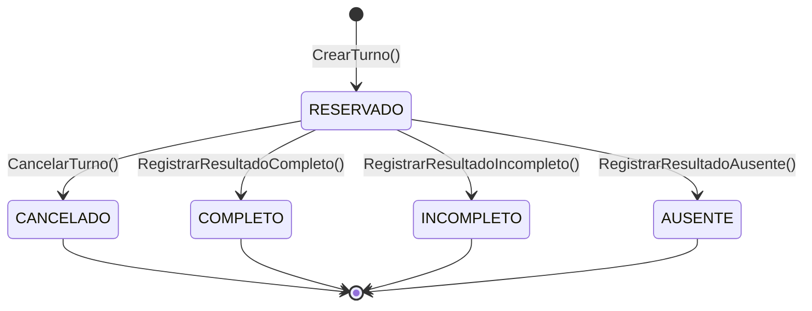

# Dominio de Operación y Cierre (`operation`)
> Sistema: **Turnero** — Municipalidad de Armstrong
> Tipo de Documento: Especificación Funcional por Dominio

Este dominio abarca la gestión del día a día municipal una vez que el ciudadano asiste a la cita. Regula el tablero de control de cola en tiempo real, las colas de sobreturnos con prioridad, las transiciones de estados del turno atendido y el registro histórico de los carnets emitidos.

---

## 1. Historias de Usuario Técnicas

- **HU-19** `ADT-08` — *Como Administrativo, quiero cargar sobreturnos para un día específico, ordenados por prioridad.*
  - **Criterios de Aceptación (CA):**
    - Permite registrar a un ciudadano para atención en el día, marcado con `es_sobreturno = true`.
    - El administrativo asigna manualmente una prioridad al sobreturno (`ALTA`, `MEDIA`, `BAJA`).
    - El sistema valida que la cantidad de sobreturnos del trámite creados en el día no supere el `limite_sobreturnos_diarios` establecido.
- **HU-20** `ADT-09` — *Como Administrativo, quiero cerrar un turno registrando el resultado de la atención.*
  - **Criterios de Aceptación (CA):**
    - El administrativo dispone de opciones rápidas para cambiar el estado de un turno `RESERVADO` activo a:
      - `COMPLETO` (Trámite finalizado de forma satisfactoria).
      - `INCOMPLETO` (El ciudadano asistió pero no se pudo finalizar el trámite; exige ingresar obligatoriamente un comentario descriptivo en `resultado_comentario`).
      - `AUSENTE` (El ciudadano no asistió a la cita).
    - Si se marca como `COMPLETO` y el trámite tiene activa la bandera `emite_carnet = true`, el sistema despliega campos obligatorios para ingresar el `numero_carnet` y la `fecha_vencimiento`. Al guardar, crea un registro histórico en la tabla `carnets`.
- **HU-21** `ADM-01` — *Como Administrador, quiero gestionar las variables globales del sistema.*
  - **Criterios de Aceptación (CA):**
    - Permite editar los parámetros en la tabla `configuracion_global` (tales como las horas mínimas de anticipación requeridas para la cancelación o reprogramación de turnos).
- **HU-22** `ADM-02` — *Operar con la cuenta única de Administrador sembrada por defecto.*
  - **Criterios de Aceptación (CA):**
    - El sistema siembra en su base de datos una única cuenta con rol `ADMINISTRADOR` y privilegios globales al inicializarse.

---

## 2. Ciclo de Vida y Máquina de Estados de `Turno`

### 2.1 Diagrama de Estados
Un turno pasa por diferentes estados operativos según las acciones del ciudadano y el personal municipal administrativo:

### 2.2 Matriz de Transiciones y Seguridad

| Estado Origen | Estado Destino | Acción / Evento | Roles Autorizados | Restricciones de Negocio |
|---|---|---|---|---|
| `*` (Ninguno) | `RESERVADO` | `CrearTurno()` | `CIUDADANO`, `ADMINISTRATIVO` | Validar disponibilidad de horario (si es regular) o límite diario (si es sobreturno). |
| `RESERVADO` | `CANCELADO` | `CancelarTurno()` | **Ciudadano:** Si faltan $\ge 24\text{ hs}$ para el inicio. **Administrativo:** En cualquier momento. | Si cancela el Administrativo, se requiere ingresar obligatoriamente un `motivo_cancelacion`. |
| `RESERVADO` | `COMPLETO` | `RegistrarResultadoCompleto()` | `ADMINISTRATIVO` | - Debe realizarse en la fecha del turno o posterior. - Si el trámite tiene `emite_carnet = true`, el sistema obliga a registrar la fecha de vencimiento e inserta un registro en la tabla `carnets`. |
| `RESERVADO` | `INCOMPLETO` | `RegistrarResultadoIncompleto()`| `ADMINISTRATIVO` | Debe ingresarse un comentario en `resultado_comentario` detallando los requisitos faltantes. |
| `RESERVADO` | `AUSENTE` | `RegistrarResultadoAusente()` | `ADMINISTRATIVO` | Cambia el estado a ausente si el ciudadano no concurrió a la cita. |

---

## 3. Reglas de Negocio del Dominio

1. **Ordenamiento de la Cola Operativa diaria:**
   - En el panel administrativo (`/admin/dashboard`), los turnos del día se listan divididos en:
     - **Turnos Regulares:** Ordenados estrictamente de forma cronológica por su horario de inicio (`fecha_hora_inicio`).
     - **Sobretornos:** Se agrupan al final de la cola diaria y se ordenan de acuerdo a las siguientes prioridades:
       1. Prioridad declarada: `ALTA` $\rightarrow$ `MEDIA` $\rightarrow$ `BAJA`.
       2. Fecha de creación (`created_at`): En caso de igual prioridad, se ordena cronológicamente (FIFO - Primero en entrar, primero en salir).
2. **Emisión de Carnets Históricos:**
   - La tabla `carnets` almacena la relación histórica del ciudadano con sus credenciales emitidas. 
   - Campos obligatorios a guardar en el cierre exitoso: `numero_carnet`, `fecha_emision` (fecha actual), `fecha_vencimiento` (ingresada manualmente por el administrativo) y `activo = true`.
   - Se eliminaron las notificaciones automáticas y alertas por email/WhatsApp sobre el vencimiento de carnet (requerimiento descartado por el cliente). La información se conserva de forma exclusiva para consulta del administrativo.
