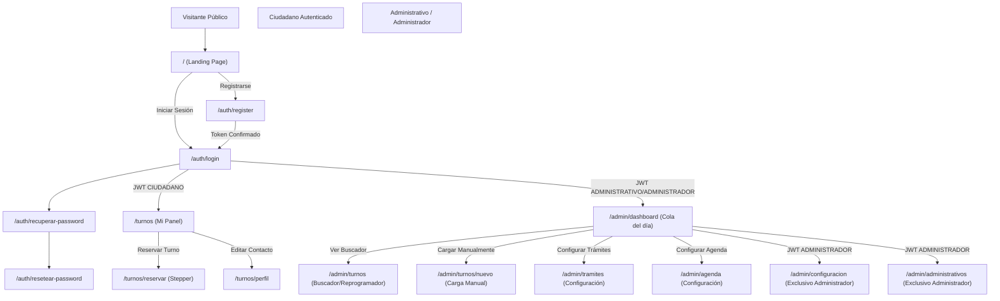

# Especificación de Rutas y Sitemap — Frontend
**Proyecto:** Turnero — Municipalidad de Armstrong  
**Tipo de Documento:** Especificación Funcional de Interfaz  

Este documento define la estructura de rutas, los permisos de acceso requeridos por rol, y el flujo de navegación lógico que debe implementar el frontend en Next.js.

---

## 1. Mapa de Rutas por Rol

El control de accesos y redirecciones se gestiona a nivel de middleware en Next.js basándose en el rol (`CIUDADANO`, `ADMINISTRATIVO`, `ADMINISTRADOR`) decodificado del JWT en la cookie de sesión.

### A. Rutas Públicas (Sin sesión requerida)
* **`/`** (Landing Page): Presentación del servicio, horarios generales de atención y acceso a iniciar trámites.
* **`/auth/login`**: Formulario de inicio de sesión único para todos los roles.
* **`/auth/register`**: Formulario de registro para nuevos ciudadanos. Requiere DNI, email y teléfono.
* **`/auth/recuperar-password`**: Solicitud de enlace de recuperación de credenciales.
* **`/auth/resetear-password`**: Aplicación de la nueva contraseña mediante token temporal.

### B. Rutas del Ciudadano (Acceso: `CIUDADANO`)
* **`/turnos`**: Vista principal ("Mi Panel"). Muestra los próximos turnos reservados del ciudadano, el historial de trámites pasados y las alertas de vencimiento de carnet.
* **`/turnos/reservar`**: Flujo de reserva interactivo en dos pasos (selección de trámite/variantes -> selección de fecha/hora).
* **`/turnos/perfil`**: Vista de edición de datos de contacto del ciudadano (teléfono e email).

### C. Rutas de Gestión Operativa (Acceso: `ADMINISTRATIVO` o `ADMINISTRADOR`)
* **`/admin/dashboard`**: Tablero operativo del día. Muestra la cola de turnos del día actual en tiempo real para todas las áreas. Permite filtrar por área/trámite y marcar asistencias/resultados.
* **`/admin/turnos`**: Buscador global de turnos históricos o futuros. Permite la edición, reprogramación o cancelación por parte de los operadores.
* **`/admin/turnos/nuevo`**: Panel de carga manual de turnos. Incluye la búsqueda rápida de ciudadano por DNI (o su registro rápido *on-the-fly*).
* **`/admin/tramites`**: Vista de trámites disponibles por área municipal. Configuración de requisitos y variantes de cada trámite.
* **`/admin/agenda`**: Configuración de los bloques horarios, días hábiles, feriados y capacidad de atención por trámite.

### D. Rutas de Configuración Global (Acceso exclusivo: `ADMINISTRADOR`)
* **`/admin/configuracion`**: Configuración de variables del sistema (ej: anticipación de cancelación, límite de sobreturnos, días previos de alerta de vencimiento).
* **`/admin/administrativos`**: Listado de cuentas administrativas. Creación de nuevos operadores y desactivación/eliminación de los mismos.

---

## 2. Diagrama Visual del Flujo de Navegación (Sitemap)

El siguiente diagrama ilustra la transición lógica de rutas y las restricciones de rol asociadas:

