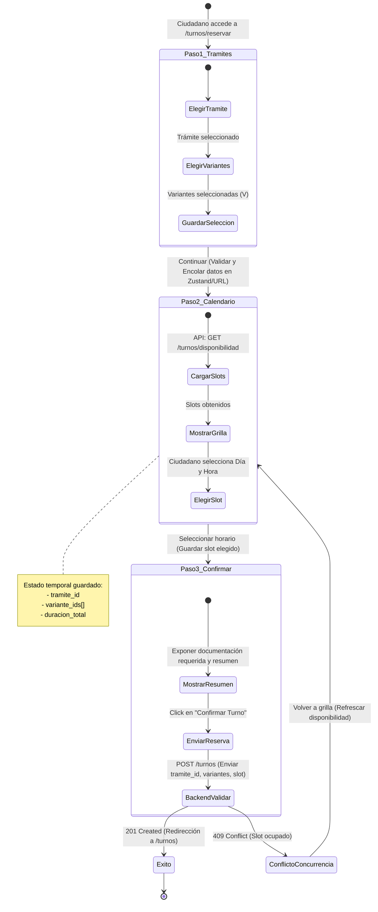

# Estándar de Arquitectura y Diseño Frontend
**Proyecto:** Turnero — Municipalidad de Armstrong  
**Tipo de Documento:** Estándar Técnico de Desarrollo  

Este documento define la arquitectura técnica del frontend, la estrategia de renderizado de Next.js, y el sistema de diseño visual (tokens y componentes) que rige el desarrollo de la interfaz de usuario.

---

## 1. Guía de Diseño Visual (Design Tokens)

El diseño del frontend se basa en las especificaciones cromáticas del documento de [identidad-visual.md](identidad-visual.md). Se utilizará **Tailwind CSS** para la implementación ágil de estilos, utilizando los siguientes tokens configurados:

### A. Paleta de Colores y Tokens de Diseño
Para mantener las proporciones visuales sugeridas por el cliente (60% fondos, 30% interacción, 5% textos, 5% destaque en naranja), se definen los siguientes tokens de color que deben ser registrados en la configuración del framework CSS:

| Token | Valor Hex | Propósito / Uso |
|---|---|---|
| **`brand.orange`** | `#FE8F00` | 30% - Interacción, cabeceras, botones principales, enlaces activos. |
| **`brand.bgLight`** | `#F0F2F5` | 60% - Fondos generales de páginas, tarjetas de información, formularios. |
| **`brand.textDark`** | `#333333` | 5% - Texto principal y de lectura, iconos sobre fondos claros. |
| **`brand.white`** | `#FFFFFF` | 5% - Texto e iconos en contraste sobre el color naranja principal. |
| **`brand.grayDark`** | `#999999` | Soporte - Texto secundario o leyendas aclaratorias. |
| **`brand.grayMedium`** | `#B6B7B8` | Soporte - Bordes de componentes y estados deshabilitados. |
| **`brand.grayLight`** | `#D3D4D6` | Soporte - Líneas divisorias y fondos secundarios suaves. |

#### Colores de Estado del Turno:
- **`estado.reservado`**: `#2563EB` (Azul - Indica un turno reservado y activo).
- **`estado.completo`**: `#16A34A` (Verde - Indica un trámite finalizado de forma satisfactoria).
- **`estado.incompleto`**: `#D97706` (Amarillo/Ámbar - Asistencia registrada pero faltó documentación).
- **`estado.ausente`**: `#DC2626` (Rojo - Ciudadano no asistió al turno).
- **`estado.cancelado`**: `#4B5563` (Gris - Turno cancelado o liberado por el sistema/usuario).


### B. Tipografía
Se importará la fuente **Montserrat** mediante `next/font/google`.
- **Títulos ($H1$):** `font-bold` (Montserrat Bold).
- **Subtítulos ($H2$):** `font-semibold` (Montserrat Semibold).
- **Cuerpo de texto / Inputs / Botones:** `font-normal` o `font-medium` (Montserrat Regular/Medium).

### C. Iconografía
Se integrará **Material Symbols & Icons** de Google con el estilo **Rounded** configurado globalmente para asegurar bordes circulares coherentes con el logotipo municipal.

### D. Uso del Logotipo Oficial (Assets de Imagen)
> [!IMPORTANT]
> **REGLA DE CONSTRUCCIÓN DE LOGOS:**
> Queda prohibido escribir código SVG dinámico o manual en el frontend para el logo. Los logos se deben cargar exclusivamente como recursos de imagen estáticos (ej: `.png` o `.svg` oficiales de la municipalidad extraídos de `identidad-visual.pdf`) almacenados en el directorio `/public/images/` del frontend y renderizados con el componente `<Image />` de Next.js.

---

## 2. Estrategia de Renderizado (SSR vs CSR vs SSG)

Para optimizar los tiempos de carga, mejorar el SEO en la landing page y proveer interactividad en los paneles, se adopta un enfoque híbrido en Next.js (App Router):

| Ruta/Página | Estrategia de Renderizado | Justificación Técnica |
| :--- | :--- | :--- |
| `/` (Landing) | **SSG (Static Site Generation)** | Contenido estático. Se pre-renderiza en build time para carga instantánea y SEO óptimo. |
| `/auth/*` | **CSR (Client-Side Rendering)** | Contiene formularios dinámicos y validaciones de cliente en tiempo real. |
| `/turnos` | **SSR (Server-Side Rendering)** | Obtiene del servidor los turnos del usuario logueado en tiempo de petición para asegurar frescura de datos. |
| `/turnos/reservar` | **Híbrido (Layout SSR + Contenido CSR)** | El contenedor inicial es del servidor para validar sesión, pero el stepper de reserva es 100% interactivo en cliente (grilla de turnos dinámicos, cálculo del carrito de variantes). |
| `/admin/*` (Paneles) | **SSR (Server-Side Rendering)** | Datos de alta criticidad que cambian constantemente. Requiere validación de rol del lado del servidor en cada request para seguridad estricta. |

---

## 3. Jerarquía y Estrategia de Componentes

Los componentes se organizarán bajo la carpeta `/src/components` del frontend siguiendo un esquema de diseño modular:

```
src/
└── components/
    ├── ui/                 # Componentes atómicos de UI (genéricos y reutilizables)
    │   ├── Button.tsx
    │   ├── Input.tsx
    │   ├── Card.tsx
    │   ├── Badge.tsx       # Muestra el estado del turno con colores brand.estado
    │   └── Dialog.tsx      # Modal de confirmación genérico
    └── business/           # Componentes de negocio (acoplados al dominio)
        ├── CartVariantes.tsx       # Selección y acumulación de variantes del ciudadano
        ├── GrillaSlots.tsx         # Renderiza los horarios libres del día
        ├── BuscadorCiudadano.tsx   # Autocompletado administrativo por DNI/Email
        ├── AtendedorTurno.tsx      # Panel para administrativo para marcar Completo/Incompleto/Ausente
        ├── PrioritySelector.tsx    # Asignación manual de prioridad de sobreturnos
        ├── ReporteDniModal.tsx     # Formulario/Modal para reportar usurpación de DNI desde registro
        ├── RequerimientosTramite.tsx # Muestra los requerimientos previos, enlaces útiles y documentos descargables
        └── GestorReportesDni.tsx   # Panel administrativo para ver, gestionar y resolver denuncias de DNI
```

### Componentes Clave de Negocio:

1. **`CartVariantes` (Carrito de Variantes):**
   - Permite agregar y quitar variantes del trámite elegido.
   - Calcula y muestra la suma total en minutos de la duración del bloque de tiempo requerido (`USU-04`).
2. **`GrillaSlots` (Grilla de Disponibilidad):**
   - Consume la disponibilidad de la API en tiempo real.
   - Muestra visualmente las franjas horarias ocupadas e inhabilitadas.
   - Bloquea optimistamente el slot seleccionado al avanzar al paso de confirmación para mitigar problemas de concurrencia.
3. **`AtendedorTurno` (Cierre Operativo):**
   - Formulario rápido utilizado por el administrativo para cambiar el estado de un turno reservado.
   - Al marcar "Completo", si el trámite tiene `emite_carnet: true`, despliega un campo obligatorio para ingresar la `fecha_vencimiento` del carnet del ciudadano.
4. **`PrioritySelector` (Priorización de Sobretornos):**
   - Permite al administrativo asignar las prioridades `ALTA`, `MEDIA` o `BAJA` al cargar un sobreturno.
   - Ordena visualmente la cola de espera de sobreturnos del día.
5. **`ReporteDniModal` (Denuncia de Usurpación):**
   - Se activa mediante un enlace de advertencia en el formulario de registro si el DNI ingresado ya existe.
   - Pide Nombre, Apellido, Email, Teléfono, DNI en conflicto (precargado) y una descripción del caso.
   - Envía el reporte mediante API pública (`POST /api/v1/reportes-usurpacion`) y notifica al ciudadano que su denuncia fue encolada para revisión.
6. **`RequerimientosTramite` (Visualización de Requisitos):**
   - Renderiza dentro de la vista de detalle del turno en la interfaz del ciudadano.
   - Convierte el texto Markdown de los requerimientos previos a HTML (sanitizado obligatoriamente con `DOMPurify` en cliente).
   - Renderiza un listado con los hipervínculos externos de enlaces útiles y una sección con los archivos de documentos descargables subidos para dicho trámite.
7. **`GestorReportesDni` (Consola de Identidad):**
   - Interfaz en el panel del administrativo para auditar reportes de usurpación de DNI.
   - Presenta los reportes listados por estado (`PENDIENTE`, `EN_PROCESO`, `RESUELTO`, `RECHAZADO`).
   - Permite al administrativo ingresar un comentario de resolución y cambiar el estado.
   - Provee un botón de acceso directo a la ficha del usuario "usurpador" con opción rápida para suspender o desactivar su cuenta de forma inmediata si se constata la irregularidad.

### 3.2 Patrón Estándar de Tablas y Modales de Lectura (Read-Only Row Click)
Para mantener la coherencia visual e interactiva en todos los paneles y tablas del sistema:
- **Interacción por Fila (`onRowClick`):** Hacer clic en cualquier registro/fila de una tabla abre automáticamente su **Modal de Detalle en Solo Lectura (*Read-Only Detail Modal*)**, permitiendo consultar información formateada, variantes y adjuntos sin riesgo de modificación.
- **Acciones Aisladas (`stopPropagation`):** Los botones de "Editar" y "Eliminar" en la columna de acciones invocan `e.stopPropagation()` para ejecutar sus flujos correspondientes sin activar la apertura del modal de detalle.
- **Encabezados Limpios:** Los títulos de las tablas se mantienen limpios (ej: *"Áreas Municipales"*, *"Trámites Configurados"*) sin incluir contadores genéricos entre paréntesis ni mensajes orientativos superfluos.


### 3.1 Flujo de Navegación y Persistencia del Stepper de Reserva
El flujo de reserva interactivo para el ciudadano se implementa como un componente de estado persistente del lado del cliente (con soporte de Zustand o parámetros de búsqueda URL) estructurado de la siguiente forma:



- **Manejo de Reintentos:** En caso de que el backend retorne un error de conflicto (`409 Conflict`), la interfaz informará de forma clara al ciudadano que el slot fue tomado por otro usuario e invalidará la grilla, forzando un refresco de disponibilidad en el Paso 2 para que seleccione un nuevo horario sin perder la configuración de variantes elegida en el Paso 1.

---

## 4. Estándares de Seguridad Frontend

### 4.1 Configuración de CSP (Content Security Policy)
Para evitar la inyección de scripts externos o ataques de clickjacking, se debe configurar una cabecera CSP estricta en el servidor web (o a través del middleware de Next.js):
- **Restricción de Scripts:** Configurar `script-src 'self'` para impedir la ejecución de código Javascript inyectado en línea o cargado desde servidores externos no autorizados.
- **Conexiones Seguras:** Forzar conexiones a la propia API y a los servicios autorizados (como la API de Meta) utilizando `connect-src 'self'`.

### 4.2 Sanitización en Renderizado Dinámico
En caso de requerir la inserción directa de HTML dinámico proporcionado por el usuario (por ejemplo, descripciones de trámites editadas por el administrador o notas de propuestas del cliente):
- **Purificación del DOM:** Queda prohibido inyectar HTML sin antes procesar el texto con una librería de sanitización robusta (como DOMPurify). Esto removerá cualquier etiqueta de script, eventos de carga u otros elementos ejecutables dañinos.

### 4.3 Control de Caché en Rutas Privadas y de Sesión
Para evitar la exposición no autorizada de datos personales e historiales de turnos en computadoras de uso público o compartido:
- **Directivas de Caché:** Las páginas dinámicas del ciudadano (`/turnos`) y del panel administrativo (`/admin/*`) deben responder inyectando obligatoriamente la cabecera HTTP `Cache-Control: no-store, no-cache, must-revalidate, max-age=0`.
- **Comportamiento:** Esto le prohíbe al navegador del cliente almacenar copias de seguridad de las vistas en el disco duro, de manera que el uso del botón "Atrás" después de cerrar sesión no exponga la información privada.

### 4.4 Guardias de Enrutado en Servidor y Cliente
- **Protección del Lado del Servidor:** La validación de roles y permisos de acceso para las secciones administrativas se debe ejecutar en Next.js del lado del servidor (SSR) antes de renderizar la página y enviar datos al cliente.
- **Principio de Desconfianza del Cliente:** El estado local del frontend (Contexto de React o almacén de datos local) no debe considerarse como prueba de autenticación de permisos; cualquier acción de escritura invocará un endpoint de API que validará la cookie JWT de forma independiente en el servidor.

