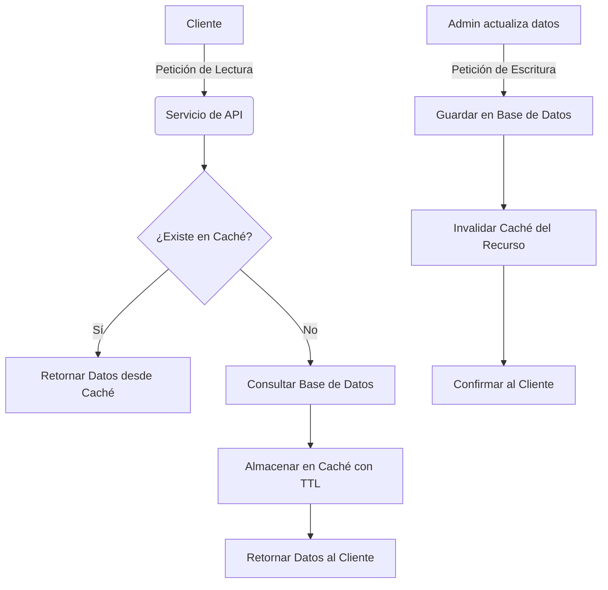
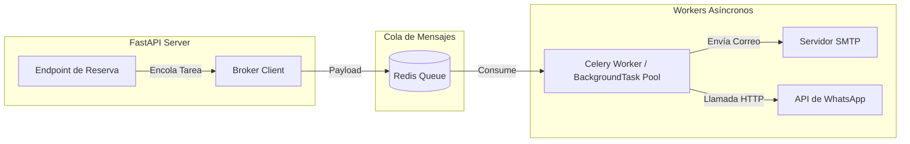
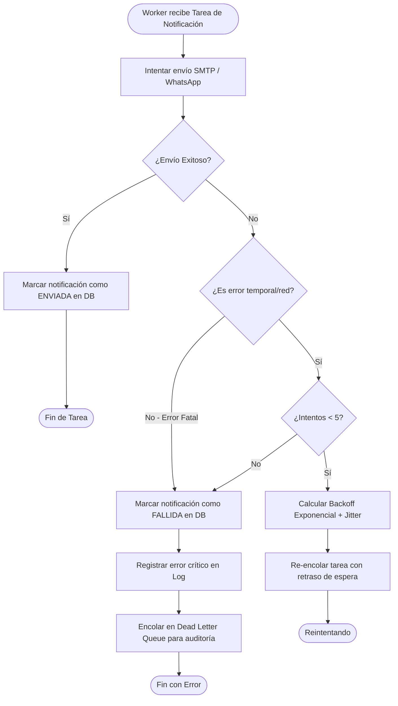
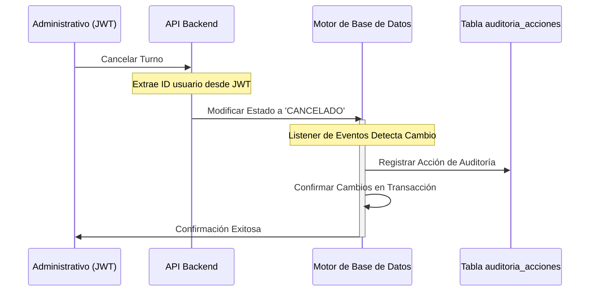

# Estándares de Infraestructura, Notificaciones y Seguridad — Turnero

Este documento establece las especificaciones técnicas obligatorias para el diseño de la base de datos, el procesamiento de tareas asíncronas de notificación y la implementación de protocolos de seguridad y auditoría en el sistema de turnos de la Municipalidad de Armstrong.

---

## 1. Infraestructura de Base de Datos y Caché (PostgreSQL & Redis)

El sistema utiliza un motor de base de datos relacional para la persistencia transaccional. Para garantizar la escalabilidad, consultas de baja latencia y robustez ante concurrencia, se definen los siguientes estándares de indexación, caching y control de transacciones.

### 1.1 Estrategia de Indexación
Para optimizar las búsquedas y reportes de la administración municipal y el flujo de los ciudadanos, se deben diseñar los siguientes índices en la base de datos:

- **Búsqueda de usuarios:** Índices únicos sobre los campos de correo electrónico y documento nacional de identidad para acelerar la autenticación y la validación de registros.
- **Optimización de turnos:** Índice compuesto que abarque el trámite, fecha/hora de inicio, fecha/hora de fin y estado para acelerar las consultas de solapamiento y validación de disponibilidad.
- **Historial del ciudadano:** Índice sobre el identificador del ciudadano y la fecha de inicio del turno para optimizar la vista del historial personal.
- **Grilla operativa diaria:** Índice sobre la fecha del turno para acelerar el listado de turnos del día para los administrativos.
- **Daemon de vencimientos:** Índice sobre la fecha de vencimiento y el estado activo en la entidad de carnets.
- **Buzón de notificaciones:** Índice sobre el usuario y el estado de lectura para optimizar las consultas de notificaciones pendientes.
- **Registro de auditoría:** Índice cronológico descendente sobre la marca de tiempo de las acciones.

### 1.2 Estrategia de Caching
Con el objetivo de reducir la carga de lectura en la base de datos principal, se establece una estrategia de caché en memoria de dos niveles:

1. **Datos Cuasi-Estáticos (Áreas, Trámites, Variantes):**
   - **Estrategia:** Almacenamiento en caché en memoria a nivel de aplicación o en un servicio de caché distribuido.
   - **Tiempo de Vida (TTL):** 24 horas.
   - **Invalidación:** Basada en eventos. Cualquier inserción, actualización o eliminación de estas entidades por parte del administrador debe limpiar inmediatamente la caché correspondiente.

2. **Configuraciones de Agenda:**
   - **Estrategia:** Caché en memoria de corta duración.
   - **Tiempo de Vida (TTL):** 1 hora.
   - **Invalidación:** Se limpia automáticamente ante cualquier modificación en las reglas de horarios o bloqueos realizada por el personal administrativo.

#### Diagrama de Flujo del Caché de Lectura:

### 1.3 Transaccionalidad y Concurrencia (Bloqueos)
Para evitar que múltiples ciudadanos reserven el mismo slot o sobrepasen la capacidad simultánea configurada en un bloque horario bajo condiciones de carrera (concurrencia), se establece el siguiente flujo procedural:

1. **Aislamiento Transaccional:** Cada proceso de reserva debe ejecutarse dentro de una transacción de base de datos dedicada.
2. **Bloqueo Pesimista:** Se debe realizar un bloqueo a nivel de fila sobre todos los turnos reservados que se solapen temporalmente con el rango solicitado para el trámite.
3. **Validación de Capacidad:** Se calcula la cantidad de turnos concurrentes bloqueados y se contrasta con el límite de la configuración de la agenda.
4. **Resolución:**
   - Si no se supera el límite de capacidad, se inserta el nuevo turno y se confirma la transacción (liberando los bloqueos).
   - Si se supera el límite, se cancela la transacción de inmediato (rollback) y se retorna un mensaje de error al usuario.

---

## 2. Arquitectura Asíncrona de Notificaciones

Las notificaciones (correo electrónico y WhatsApp) son críticas para la experiencia del usuario y la reducción del ausentismo. Con el fin de no degradar el tiempo de respuesta de la API, se establece un modelo asíncrono desacoplado.

### 2.1 Topología de Procesamiento Asíncrono
Se implementa una arquitectura de mensajería asíncrona:
- La API recibe la solicitud del cliente, registra el evento y encola los metadatos de la notificación en un gestor de tareas en segundo plano.
- La API responde de forma inmediata al cliente con un código de éxito.
- Un proceso worker independiente consume la tarea de la cola y realiza la comunicación con el servicio de correo o la API de WhatsApp de forma externa.

### 2.2 Estrategia de Resiliencia y Reintentos
Los servicios externos pueden experimentar caídas temporales o límites de velocidad. Se definen las siguientes reglas de control de fallos:
- **Reintentos automáticos:** Ante errores de red o códigos de error temporal de los proveedores externos.
- **Espera Exponencial (Backoff Exponencial con Jitter):** El tiempo de espera entre reintentos se incrementa de forma exponencial con una variación aleatoria para mitigar la sobrecarga sobre el servicio externo.
- **Límite de Intentos:** Un máximo de 5 reintentos en un periodo de 24 horas.
- **Tratamiento de Fallos Persistentes (Dead Letter Queue):** Si la tarea falla tras agotar los reintentos, se registra el error crítico en el sistema de logs, se marca la notificación como fallida en la base de datos y se notifica al administrador para su gestión manual.

#### Diagrama de Flujo del Ciclo de Reintentos de Notificación

### 2.3 Detalles de Integración de Mensajería
- **Canal de Correo Electrónico:** Envío de correos multi-parte (texto plano y HTML). Las planillas obligatorias se adjuntan como archivo adjunto o se proporciona un enlace temporal único y firmado para su descarga.
- **Canal de WhatsApp:** Consumo del servicio oficial de mensajería del municipio mediante llamadas seguras, utilizando plantillas pre-aprobadas con variables dinámicas de contexto.

---

## 3. Seguridad y Auditoría Administrativa

La seguridad protege los datos personales de los ciudadanos y previene modificaciones no autorizadas en las agendas públicas del municipio.

### 3.1 Autenticación Basada en Cookies JWT `HttpOnly`
Para mitigar ataques de robo de sesión a través de Scripts Cross-Site (XSS), las credenciales de sesión se gestionarán de la siguiente manera:

- **Almacenamiento del Token:** El token de sesión se emite desde el servidor como una cookie con atributos de seguridad estrictos.
- **Atributos de la Cookie:**
  - `HttpOnly`: Impide el acceso al token mediante scripts del cliente.
  - `Secure`: Obliga a transmitir la cookie únicamente a través de conexiones cifradas HTTPS.
  - `SameSite=Lax`: Protege contra ataques de falsificación de peticiones en sitios cruzados (CSRF).
  - `Path=/`: Restringe la cookie para el uso exclusivo de la aplicación web.
- **Estructura del Token:** Token firmado digitalmente con un algoritmo simétrico robusto. El tiempo de expiración se establece en 24 horas y contiene el identificador de usuario, correo electrónico, rol asignado y marcas de tiempo de validez.

### 3.2 Encriptación y Protección de Datos
1. **Contraseñas de Usuarios:** Almacenamiento mediante funciones de hash criptográfico con salting dinámico y factor de trabajo adaptativo para asegurar la resistencia contra ataques de fuerza bruta.
2. **Encriptación en Tránsito:** Cifrado obligatorio de todas las comunicaciones mediante protocolos de red seguros (TLS) en todas las conexiones del cliente al frontend, del frontend a la API, y de la API a la base de datos.
3. **Gestión de Secretos:** Las llaves de firma, contraseñas de bases de datos y tokens de servicios externos deben administrarse exclusivamente mediante variables de entorno del servidor.

### 3.3 Flujo Automatizado de Auditoría Administrativa
Se requiere mantener un registro de auditoría inalterable para documentar cada cambio administrativo. Para asegurar la integridad, este registro debe realizarse de forma automática mediante escuchadores (listeners) integrados en el ciclo de vida del ORM de base de datos.

- **Acciones Auditadas Obligatoriamente:**
  - Creación y eliminación de cuentas de usuarios administrativos.
  - Modificaciones en la configuración de la agenda o parámetros globales del trámite.
  - Cancelaciones de turnos efectuadas por personal interno (requiriendo obligatoriamente un motivo de cancelación).
  - Cierre y edición del resultado de los turnos atendidos.
- **Funcionamiento del Interceptor:**
  1. El motor de persistencia detecta un cambio en las entidades críticas antes de confirmar la escritura en base de datos.
  2. Extrae de forma automática el identificador del usuario administrativo que realiza la operación y el detalle de los campos modificados.
  3. Genera e inserta una nueva fila en la tabla de auditoría de acciones describiendo el cambio, consolidándose dentro de la misma transacción para garantizar la atomicidad.

---

## 4. Protección y Privacidad de Datos Sensibles (PII)

Para salvaguardar los derechos de privacidad de los ciudadanos y asegurar el cumplimiento de las normativas de protección de datos personales, se establecen las siguientes directrices técnicas para la gestión de Información de Identificación Personal (PII):

### 4.1 Identificación de Datos Sensibles
Se consideran datos sensibles (PII) dentro del dominio del turnero:
- El Documento Nacional de Identidad del ciudadano.
- El correo electrónico del ciudadano.
- El número de teléfono celular del ciudadano.
- El número de carnet físico emitido tras un trámite completo.

### 4.2 Encriptación en Reposo (At Rest)
Para proteger la PII ante posibles accesos no autorizados a la base de datos o a copias de seguridad físicas:
- **Cifrado Simétrico a Nivel de Columna:** Las columnas que almacenan el DNI, teléfono y número de carnet en la base de datos deben encriptarse mediante algoritmos estándares de cifrado simétrico (ej. AES-256) antes de escribirse en el disco.
- **Gestión de Llaves de Cifrado:** Las claves criptográficas deben gestionarse y almacenarse en un servidor de llaves dedicado o inyectarse en memoria durante el inicio del servidor, completamente aisladas del almacenamiento de la base de datos.
- **Búsqueda Segura sobre Campos Cifrados:** Para permitir búsquedas rápidas (como buscar un ciudadano por su DNI sin descifrar toda la tabla), se debe generar una columna indexada que almacene un hash criptográfico de una sola vía (como HMAC con sal fija del sistema) calculado a partir del dato en claro.

### 4.3 Enmascaramiento de Datos (Data Masking)
Para limitar la exposición innecesaria de información personal en entornos operativos:
- **Enmascaramiento en Logs:** Queda prohibido escribir datos de PII en los registros de depuración o consola del servidor. Cualquier referencia a un usuario debe realizarse utilizando su identificador único universal (UUID) o mediante valores enmascarados.
- **Enmascaramiento en Vistas y API:**
  - Los endpoints de la API deben retornar los datos sensibles con máscaras de caracteres para ocultar su contenido por defecto, a menos que el usuario solicitante cuente con roles administrativos autorizados para ver el dato en claro.
  - **Patrón de enmascaramiento estándar:**
    - Documento de Identidad: Mostrar únicamente los últimos tres dígitos (ej. XX.XXX.789).
    - Correo Electrónico: Ocultar los caracteres centrales de la dirección (ej. j***z@gmail.com).
    - Teléfono Celular: Mostrar únicamente los últimos tres dígitos y el código de área (ej. +54 9 3471 ***567).

### 4.4 Política de Retención y Derecho al Olvido
Para garantizar la minimización de datos personales almacenados en el tiempo:
- **Anonimización Periódica:** Se ejecutará un proceso automático periódico que analice todos los turnos que hayan sido finalizados, ausentes o cancelados con una antigüedad mayor a dos años.
- **Procedimiento de Anonimización:** Los datos sensibles del ciudadano asociados al turno se sobrescribirán con valores nulos o hashes irreversibles. Esto elimina la vinculación física con la persona, impidiendo su reidentificación, pero conserva la información agregada (como el trámite, área y fecha) necesaria para la elaboración de estadísticas municipales.

---

## 5. Controles Adicionales de Seguridad Backend

### 5.1 Restricciones de CORS (Cross-Origin Resource Sharing)
Para mitigar el consumo no autorizado de la API por parte de aplicaciones externas, el servidor web y la API de turnos deben implementar políticas estrictas de CORS:
- **Orígenes Permitidos:** Se restringirá el acceso exclusivamente al nombre de dominio oficial de la municipalidad. Queda prohibido el uso del comodín de acceso general en entornos de producción.
- **Métodos Permitidos:** Solo se habilitarán los métodos HTTP estrictamente requeridos por la aplicación (GET, POST, DELETE y OPTIONS para las solicitudes previas).

### 5.2 Validación Estricta de Esquemas de Entrada y Tipos
Para prevenir vulnerabilidades derivadas del ingreso de datos maliciosos o malformados, todos los datos entrantes del cliente deben pasar por validaciones obligatorias:
- **Modelos de Validación:** Todos los endpoints de la API deben forzar la validación de tipos mediante modelos de datos definidos en el código del servidor (por ejemplo, Pydantic).
- **Límites de Longitud y Expresiones Regulares:** Se deben configurar límites de caracteres máximos y mínimos para nombres, DNI, correos y comentarios. Los campos críticos como correos electrónicos o números telefónicos deben validarse mediante expresiones regulares estrictas antes de procesarse.

### 5.3 Sistema de Revocación e Invalidación de Sesiones (JWT Blacklist)
Debido a la naturaleza descentralizada de los tokens JWT, se requiere un mecanismo para anular de inmediato la sesión de un usuario (por ejemplo, cuando realiza un cierre de sesión voluntario o cuando el administrador deshabilita una cuenta municipal):
- **Almacenamiento de Tokens Revocados:** Al cerrar sesión o bloquear una cuenta, el token de sesión correspondiente debe guardarse en una base de datos en memoria de acceso ultra rápido (por ejemplo, Redis).
- **Control de Acceso:** En cada petición autenticada, el middleware del servidor verificará la presencia del token en la lista de exclusión. Si el token está en la lista, se rechazará el acceso inmediatamente.
- **Expiración de la Lista Negra:** Los tokens en la lista negra tendrán un tiempo de vida (TTL) equivalente al tiempo restante de su validez original para liberar memoria automáticamente.

### 5.4 Protocolos Seguros y Autenticación con Proveedores Externos
- **Servicio de Correo (SMTP):** Las comunicaciones con el servidor de correo corporativo deben realizarse obligatoriamente mediante protocolos de red cifrados (STARTTLS o SMTPS), garantizando que las credenciales de envío nunca viajen en texto claro por la red.
- **API de Meta para WhatsApp:** El endpoint del webhook de recepción de mensajes de WhatsApp debe validar obligatoriamente la firma digital del encabezado (SHA256 utilizando la clave secreta del webhook de Meta) para comprobar la procedencia auténtica de cada notificación.

### 5.5 Principio de Privilegios Mínimos en la Base de Datos
- **Restricción de Accesos:** La cuenta de usuario del motor de base de datos relacional utilizada por la API del turnero no debe poseer privilegios de superusuario ni permisos de administración estructural.
- **Acceso Acotado:** Los permisos otorgados deben limitarse exclusivamente a operaciones de lectura, escritura y modificación de registros sobre las tablas del turnero municipal, bloqueando cualquier acción de modificación de estructuras o accesos a otros esquemas de la administración.

