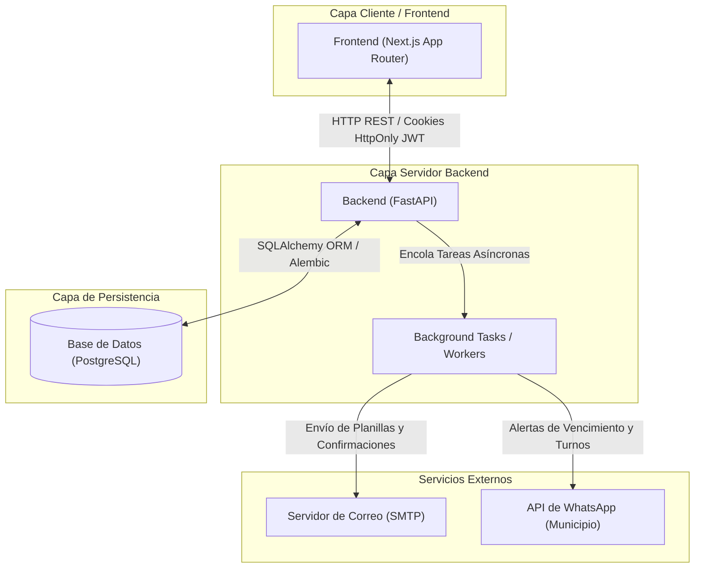

# Estándares de Ingeniería y Gobernanza del Proyecto
**Proyecto:** Turnero — Municipalidad de Armstrong

Este documento establece las reglas de calidad, estándares técnicos, decisiones de arquitectura base y el procedimiento de desarrollo que se debe seguir estrictamente para contribuir a este proyecto. Ningún desarrollo de componente o módulo del sistema debe iniciarse si sus especificaciones funcionales y técnicas no cumplen con esta guía.

---

## 1. Regla de Oro: Desarrollo Guiado por Especificaciones (Spec-Driven Development)

El desarrollo en los repositorios de código (`turnero` y `turnero_api`) debe realizarse utilizando el repositorio de documentación (`docs`) como la **única fuente de verdad (SSOT)**.

### Flujo de Trabajo Obligatorio:
1. **Lectura de Especificaciones:** Se deben consultar las especificaciones refinadas y los contratos del módulo antes de escribir código.
2. **Prohibición de Supuestos:** Si una regla de negocio o comportamiento técnico no está explícito en la documentación de contratos, diagramas o base de datos, no se debe asumir su funcionamiento. Se debe reportar el vacío y actualizar la documentación antes de continuar.
3. **Validación Automática:** Toda funcionalidad implementada debe contar con pruebas automatizadas basadas en los criterios de aceptación especificados en el documento de requerimientos refinados.

---

## 2. Estándares de Documentación Técnicos

Cada fase de la hoja de ruta debe producir artefactos legibles y procesables de forma unívoca:

### A. Modelado de Dominio (Fase 2)
- Todo modelo de datos debe documentarse en `modelo-dominio.md`.
- Debe incluir un diagrama **Entity-Relationship (ERD)** utilizando la sintaxis de **Mermaid**.
- Cada tabla debe detallar:
  - Nombre de la columna, tipo de dato SQL exacto (ej. `VARCHAR(255)`, `TIMESTAMP WITH TIME ZONE`).
  - Restricciones (`NOT NULL`, `UNIQUE`, `PRIMARY KEY`, `FOREIGN KEY`).
  - Breve descripción del propósito de la columna.
- **Máquinas de Estado:** Las entidades con estados dinámicos (como `Turno`) deben poseer un diagrama de estados Mermaid que declare formalmente las transiciones permitidas y el rol requerido para realizarlas.

### B. Especificación de la API (Fase 3)
- El contrato de la API se debe definir en un archivo OpenAPI 3.0 estándar ([openapi.yaml](../especificaciones/openapi.yaml)).
- Reglas para el diseño de la API:
  - **RESTful estricto:** Recursos en plural (ej. `/api/v1/turnos`, `/api/v1/tramites`). Queda estrictamente prohibido el uso de verbos en los paths o URIs de los endpoints (ej. evitar `/cancelar` o `/login`). Las transiciones y cambios de estado de un recurso deben gestionarse mediante actualizaciones parciales `PATCH` sobre el recurso (ej. cancelar o cerrar un turno se realiza modificando su propiedad `estado` mediante `PATCH /turnos/{id}`). La autenticación se modela como operaciones sobre recursos de tokens/sesión (`POST /auth/tokens` para login, y `DELETE /auth/tokens` para logout).
  - **Versionado:** Prefijo `/api/v1/` obligatorio.
  - **Manejo de Errores Estándar:** Las respuestas de error deben usar el formato RFC 7807 (Problem Details) o un esquema uniforme que contenga una descripción legible del error (detail), un código de error interno (code), y la marca de tiempo de ocurrencia (timestamp).
  - **Códigos de Estado HTTP:**
    - `200 OK` para consultas exitosas.
    - `201 Created` para creación exitosa.
    - `400 Bad Request` para errores de validación de negocio.
    - `401 Unauthorized` si falta token o es inválido.
    - `403 Forbidden` si el rol no tiene privilegios para el recurso.
    - `404 Not Found` si el recurso no existe.
    - `409 Conflict` para violaciones de concurrencia o duplicados.
    - `422 Unprocessable Entity` para errores de esquema en el request.

### C. Especificaciones de UI/UX (Fase 4)
- El archivo `frontend-ux-ui.md` debe definir:
  - **Rutas del Frontend:** Mapa del sitio explícito con accesos por rol (Público, Ciudadano, Administrativo, Administrador).
  - **Jerarquía de Componentes:** Componentes atómicos (Botones, Inputs) vs. Componentes de Negocio (CalendarioTurnos, ListaTramites).
  - **Estrategia de Renderizado (SSR vs CSR):** Definir para cada página de Next.js si se utilizará Server-Side Rendering, Static Site Generation o Client-Side Rendering.

---

## 3. Decisiones de Arquitectura Base (ADRs)

### Backend (`turnero_api`)
- **Lenguaje y Framework:** Python 3.11+ con **FastAPI**.
- **Base de Datos:** PostgreSQL para persistencia transaccional y relacional.
- **ORM:** SQLAlchemy (declarativo moderno 2.0+) con migraciones gestionadas por **Alembic**.
- **Tareas Asíncronas:** Dado el requerimiento de notificaciones inmediatas por WhatsApp y Email, se requiere una arquitectura basada en **Background Tasks de FastAPI** (para simplicidad inicial) o **Celery con Redis** si el volumen de concurrencia lo amerita. *Queda estrictamente prohibido bloquear el hilo de ejecución principal de la API enviando un WhatsApp o un correo electrónico.*

### Frontend (`turnero`)
- **Framework:** **Next.js** (App Router).
- **Lenguaje:** **TypeScript** con tipado estricto (`strict: true` en `tsconfig.json`).
- **Estilos:** **Tailwind CSS** (estandarizado en la Fase 4 con Design Tokens).

### Seguridad
- **Autenticación:** JWT (JSON Web Tokens) transmitidos mediante cookies HTTP-only (`session_token`) en el frontend para mitigar ataques XSS.
- **Contraseñas:** Encriptación irreversible en base de datos mediante **bcrypt** (con salt robusto).
- **Autorización:** RBAC (Role-Based Access Control) validado tanto en los endpoints de la API (Backend) como en los middlewares de Next.js (Frontend).

### Diagrama de Arquitectura de Bloques
El siguiente diagrama describe la topología de la aplicación e integraciones:

### Variables de Entorno Requeridas (Estandarización para Agentes de IA)
Para asegurar que el desarrollo por IA mantenga coherencia en las configuraciones locales y de entorno, se definen las siguientes variables obligatorias a configurar conceptualmente:

#### Configuración del Backend (`turnero_api`):
- **Puerto y Entorno:** Puerto de escucha (por defecto 8000) y entorno de ejecución (desarrollo o producción).
- **Base de Datos:** URI de conexión a la base de datos PostgreSQL.
- **Seguridad:** Clave secreta para la firma de tokens JWT, algoritmo de firma (ej. HS256) y tiempo de expiración de los tokens (en minutos).
- **Notificaciones (SMTP - Correo):** Host del servidor SMTP, puerto de conexión, usuario, contraseña de aplicación y remitente.
- **Notificaciones (WhatsApp API):** URL base del endpoint oficial de WhatsApp del municipio y token de autenticación.

#### Configuración del Frontend (`turnero`):
- **API URL:** URL base pública del backend para el consumo de servicios REST.

---

## 4. Guía de Estilo y Calidad de Código

Todo código desarrollado en el backend o frontend debe cumplir con las siguientes directrices de calidad:

### Tipado y Documentación Interna:
- Todo archivo de código debe tener tipado estático explícito. En Python, usar type hints y esquemas Pydantic para validación de datos. En TypeScript, usar `interfaces` o `types` explícitos; evitar el uso de `any`.
- Mantener los comentarios descriptivos que aporten contexto ("el porqué", no "el qué").

### Calidad de Pruebas:
- **Backend (`turnero_api`):**
  - Cada endpoint crítico (reserva, cancelación, autenticación) debe contar con tests de integración automatizados utilizando `pytest` y `httpx.AsyncClient`.
  - Cobertura mínima esperada: **80%** en la lógica de negocio central (servicios y helpers de validación).
- **Frontend (`turnero`):**
  - Pruebas unitarias de componentes de negocio (como `CartVariantes` y `GrillaSlots`) utilizando **Jest** y **React Testing Library**.
  - Pruebas de extremo a extremo (E2E) para flujos críticos (Registro, Reserva de Turnos y Cancelación) utilizando **Playwright** o **Cypress**.

### Criterios de Aceptación Ejecutables (Gherkin):
Las historias de usuario complejas descritas en los requerimientos refinados deben acompañarse de criterios de aceptación estructurados en formato `Given / When / Then` para facilitar el desarrollo de pruebas de comportamiento automatizadas (BDD).
