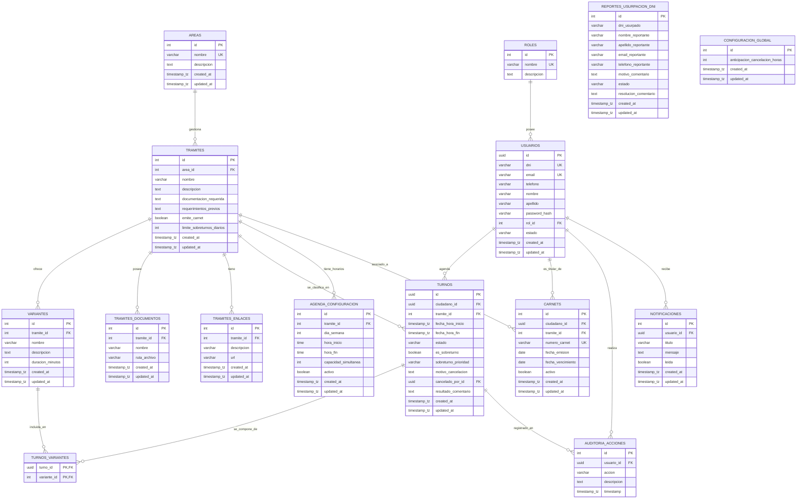
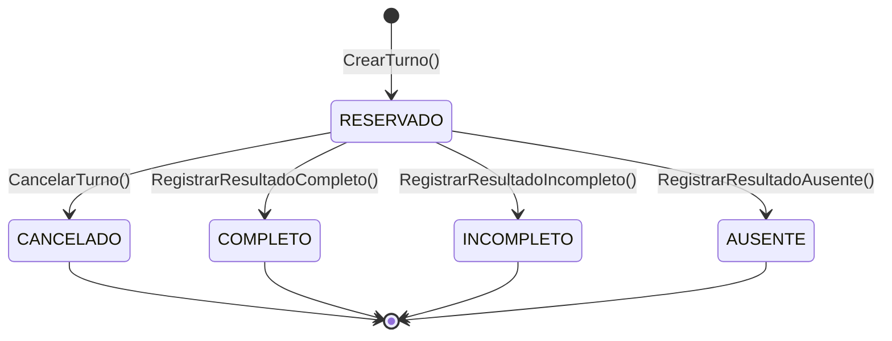
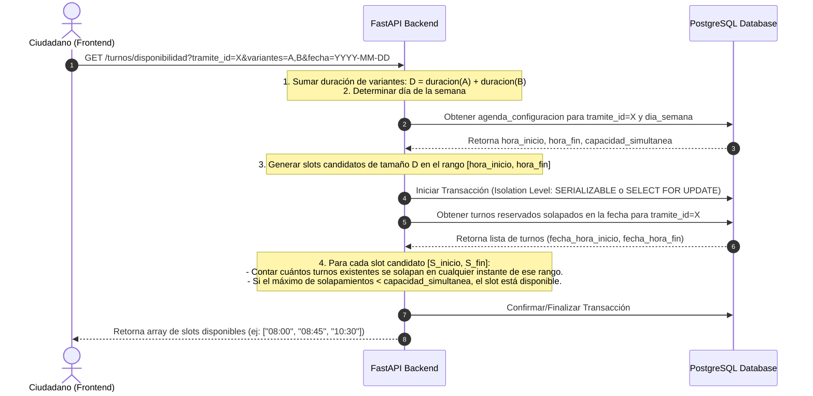

# Modelo del Dominio y Reglas de Negocio — Turnero

Este documento define la estructura de datos, restricciones de base de datos relacional y reglas de negocio para el sistema de turnos de la Municipalidad de Armstrong.

---

## 1. Diagrama Entidad-Relación (ERD)

El siguiente diagrama en formato Mermaid ilustra las entidades del sistema y sus relaciones.

---

## 2. Diccionario de Datos (Esquema SQL)

### 2.1 Tabla `roles`
Almacena los roles del sistema que rigen el control de acceso (RBAC).

| Columna | Tipo SQL | Restricciones | Descripción |
|---|---|---|---|
| `id` | `SERIAL` (or `INTEGER`) | `PRIMARY KEY` | Identificador único del rol. |
| `nombre` | `VARCHAR(50)` | `NOT NULL`, `UNIQUE` | Nombre del rol (`CIUDADANO`, `ADMINISTRATIVO`, `ADMINISTRADOR`). |
| `descripcion` | `TEXT` | `NULL` | Descripción de los permisos del rol. |

### 2.2 Tabla `usuarios`
Registra la información de contacto y credenciales de acceso para ciudadanos, administrativos y administradores.

| Columna | Tipo SQL | Restricciones | Descripción |
|---|---|---|---|
| `id` | `UUID` | `PRIMARY KEY`, `DEFAULT gen_random_uuid()` | Identificador único de usuario. |
| `dni` | `VARCHAR(20)` | `NOT NULL`, `UNIQUE` | Documento Nacional de Identidad del usuario. |
| `email` | `VARCHAR(255)` | `NOT NULL`, `UNIQUE` | Correo electrónico de acceso y notificaciones. |
| `telefono` | `VARCHAR(50)` | `NOT NULL` | Teléfono de contacto (para notificaciones de WhatsApp). |
| `nombre` | `VARCHAR(100)` | `NOT NULL` | Nombre de pila. |
| `apellido` | `VARCHAR(100)` | `NOT NULL` | Apellido(s). |
| `password_hash` | `VARCHAR(255)` | `NOT NULL` | Hash de la contraseña mediante `bcrypt`. |
| `rol_id` | `INTEGER` | `NOT NULL`, `REFERENCES roles(id)` | Rol asignado al usuario. |
| `estado` | `VARCHAR(50)` | `NOT NULL`, `DEFAULT 'PENDING_VALIDATION'` | Estado de la cuenta (`PENDING_VALIDATION`, `ACTIVE`, `INACTIVE`). |
| `created_at` | `TIMESTAMP WITH TIME ZONE` | `NOT NULL`, `DEFAULT CURRENT_TIMESTAMP` | Fecha y hora de creación. |
| `updated_at` | `TIMESTAMP WITH TIME ZONE` | `NOT NULL`, `DEFAULT CURRENT_TIMESTAMP` | Última actualización. |

*Índices recomendados:*
- `idx_usuarios_email` en `email` (búsqueda en login).
- `idx_usuarios_dni` en `dni` (búsqueda de ciudadanos durante el registro simultáneo).

### 2.3 Tabla `areas`
Entidades de administración del municipio (ej: Tránsito, Rentas, Obras Particulares).

| Columna | Tipo SQL | Restricciones | Descripción |
|---|---|---|---|
| `id` | `SERIAL` | `PRIMARY KEY` | Identificador único del área. |
| `nombre` | `VARCHAR(100)` | `NOT NULL`, `UNIQUE` | Nombre identificador del área. |
| `descripcion` | `TEXT` | `NULL` | Detalle de las responsabilidades del área. |
| `created_at` | `TIMESTAMP WITH TIME ZONE` | `NOT NULL`, `DEFAULT CURRENT_TIMESTAMP` | Fecha de creación. |
| `updated_at` | `TIMESTAMP WITH TIME ZONE` | `NOT NULL`, `DEFAULT CURRENT_TIMESTAMP` | Última actualización. |

### 2.4 Tabla `tramites`
Gestiones específicas pertenecientes a un área.

| Columna | Tipo SQL | Restricciones | Descripción |
|---|---|---|---|
| `id` | `SERIAL` | `PRIMARY KEY` | Identificador del trámite. |
| `area_id` | `INTEGER` | `NOT NULL`, `REFERENCES areas(id)` | Área a la que pertenece el trámite. |
| `nombre` | `VARCHAR(150)` | `NOT NULL` | Nombre del trámite (ej: "Renovación Carnet de Conducir B1"). |
| `descripcion` | `TEXT` | `NULL` | Explicación del trámite. |
| `documentacion_requerida` | `TEXT` | `NOT NULL` | Lista de requisitos y documentación que debe traer el día del turno (formato markdown/texto). |
| `requerimientos_previos` | `TEXT` | `NULL` | Acciones o requisitos previos que debe cumplir antes de asistir (formato markdown/texto). |
| `emite_carnet` | `BOOLEAN` | `NOT NULL`, `DEFAULT FALSE` | Indica si finalizar el trámite genera un Carnet habilitante. |
| `limite_sobreturnos_diarios` | `INTEGER` | `NOT NULL`, `DEFAULT 5` | Límite diario de sobreturnos para este trámite (o `NULL` para ilimitado). |
| `created_at` | `TIMESTAMP WITH TIME ZONE` | `NOT NULL`, `DEFAULT CURRENT_TIMESTAMP` | Fecha de creación. |
| `updated_at` | `TIMESTAMP WITH TIME ZONE` | `NOT NULL`, `DEFAULT CURRENT_TIMESTAMP` | Última actualización. |

### 2.5 Tabla `variantes`
Sub-tipificaciones de un trámite que definen la duración en minutos.

| Columna | Tipo SQL | Restricciones | Descripción |
|---|---|---|---|
| `id` | `SERIAL` | `PRIMARY KEY` | Identificador único. |
| `tramite_id` | `INTEGER` | `NOT NULL`, `REFERENCES tramites(id) ON DELETE CASCADE` | Trámite al que pertenece. |
| `nombre` | `VARCHAR(150)` | `NOT NULL` | Nombre de la variante (ej: "Primera Vez", "Renovación"). |
| `descripcion` | `TEXT` | `NULL` | Descripción opcional. |
| `duracion_minutos` | `INTEGER` | `NOT NULL`, `CHECK (duracion_minutos > 0)` | Tiempo estimado en minutos que consume atender esta variante. |
| `created_at` | `TIMESTAMP WITH TIME ZONE` | `NOT NULL`, `DEFAULT CURRENT_TIMESTAMP` | Fecha de creación. |
| `updated_at` | `TIMESTAMP WITH TIME ZONE` | `NOT NULL`, `DEFAULT CURRENT_TIMESTAMP` | Última actualización. |

### 2.6 Tabla `turnos`
Registro central de turnos normales y sobreturnos.

| Columna | Tipo SQL | Restricciones | Descripción |
|---|---|---|---|
| `id` | `UUID` | `PRIMARY KEY`, `DEFAULT gen_random_uuid()` | Identificador del turno. |
| `ciudadano_id` | `UUID` | `NOT NULL`, `REFERENCES usuarios(id)` | Ciudadano titular del turno. |
| `tramite_id` | `INTEGER` | `NOT NULL`, `REFERENCES tramites(id)` | Trámite reservado. |
| `fecha_hora_inicio` | `TIMESTAMP WITH TIME ZONE` | `NOT NULL` | Fecha y hora de inicio del turno. |
| `fecha_hora_fin` | `TIMESTAMP WITH TIME ZONE` | `NOT NULL` | Fecha y hora de finalización del turno (calculada). |
| `estado` | `VARCHAR(50)` | `NOT NULL`, `DEFAULT 'RESERVADO'` | Estado operativo (`RESERVADO`, `COMPLETO`, `INCOMPLETO`, `AUSENTE`, `CANCELADO`). |
| `es_sobreturno` | `BOOLEAN` | `NOT NULL`, `DEFAULT FALSE` | `true` si es un sobreturno fuera de la capacidad regular de agenda. |
| `sobreturno_prioridad` | `VARCHAR(20)` | `NULL` | Prioridad del sobreturno (`ALTA`, `MEDIA`, `BAJA`). Solo aplica si `es_sobreturno = true`. |
| `motivo_cancelacion` | `TEXT` | `NULL` | Comentario explicativo si el turno es cancelado. |
| `cancelado_por_id` | `UUID` | `NULL`, `REFERENCES usuarios(id)` | Usuario (ciudadano o administrativo) que canceló el turno. |
| `resultado_comentario` | `TEXT` | `NULL` | Notas finales del administrativo tras la atención. |
| `created_at` | `TIMESTAMP WITH TIME ZONE` | `NOT NULL`, `DEFAULT CURRENT_TIMESTAMP` | Fecha de creación/solicitud. |
| `updated_at` | `TIMESTAMP WITH TIME ZONE` | `NOT NULL`, `DEFAULT CURRENT_TIMESTAMP` | Última actualización. |

*Índices recomendados:*
- `idx_turnos_rango` en `(tramite_id, fecha_hora_inicio, fecha_hora_fin, estado)` para búsquedas de disponibilidad y superposiciones.
- `idx_turnos_ciudadano` en `ciudadano_id` para ver el historial personal del usuario.

### 2.7 Tabla `turnos_variantes`
Tabla asociativa (Muchos a Muchos) que mapea las variantes seleccionadas en una reserva única.

| Columna | Tipo SQL | Restricciones | Descripción |
|---|---|---|---|
| `turno_id` | `UUID` | `NOT NULL`, `REFERENCES turnos(id) ON DELETE CASCADE` | Turno asociado. |
| `variante_id` | `INTEGER` | `NOT NULL`, `REFERENCES variantes(id)` | Variante solicitada. |

*Restricción:* `PRIMARY KEY (turno_id, variante_id)`

### 2.8 Tabla `agenda_configuracion`
Configuración semanal de la agenda de atención por trámite.

| Columna | Tipo SQL | Restricciones | Descripción |
|---|---|---|---|
| `id` | `SERIAL` | `PRIMARY KEY` | Identificador de la regla de agenda. |
| `tramite_id` | `INTEGER` | `NOT NULL`, `REFERENCES tramites(id)` | Trámite al que se aplica esta regla de atención. |
| `dia_semana` | `INTEGER` | `NOT NULL`, `CHECK (dia_semana BETWEEN 0 AND 6)` | Día de la semana (0 = Domingo, 1 = Lunes, ..., 6 = Sábado). |
| `hora_inicio` | `TIME` | `NOT NULL` | Hora de inicio de atención del bloque. |
| `hora_fin` | `TIME` | `NOT NULL`, `CHECK (hora_fin > hora_inicio)` | Hora de fin de atención del bloque. |
| `capacidad_simultanea` | `INTEGER` | `NOT NULL`, `DEFAULT 1`, `CHECK (capacidad_simultanea > 0)` | Número de ciudadanos que pueden ser atendidos en simultáneo en ese bloque de tiempo. |
| `activo` | `BOOLEAN` | `NOT NULL`, `DEFAULT TRUE` | Permite deshabilitar temporalmente un día. |
| `created_at` | `TIMESTAMP WITH TIME ZONE` | `NOT NULL`, `DEFAULT CURRENT_TIMESTAMP` | Fecha de creación. |
| `updated_at` | `TIMESTAMP WITH TIME ZONE` | `NOT NULL`, `DEFAULT CURRENT_TIMESTAMP` | Última actualización. |

*Índices recomendados:*
- `idx_agenda_tramite_dia` en `(tramite_id, dia_semana, activo)` para verificar disponibilidad.

### 2.9 Tabla `carnets`
Registro de los carnets habilitantes locales emitidos tras trámites exitosos.

| Columna | Tipo SQL | Restricciones | Descripción |
|---|---|---|---|
| `id` | `SERIAL` | `PRIMARY KEY` | Identificador único del registro de carnet. |
| `ciudadano_id` | `UUID` | `NOT NULL`, `REFERENCES usuarios(id)` | Titular del carnet. |
| `tramite_id` | `INTEGER` | `NOT NULL`, `REFERENCES tramites(id)` | Trámite que originó el carnet. |
| `numero_carnet` | `VARCHAR(100)` | `NOT NULL`, `UNIQUE` | Código o identificador físico del carnet. |
| `fecha_emision` | `DATE` | `NOT NULL` | Fecha de emisión. |
| `fecha_vencimiento` | `DATE` | `NOT NULL`, `CHECK (fecha_vencimiento > fecha_emision)` | Fecha de vencimiento del carnet. |
| `activo` | `BOOLEAN` | `NOT NULL`, `DEFAULT TRUE` | Permite desactivar/revocar manualmente. |
| `created_at` | `TIMESTAMP WITH TIME ZONE` | `NOT NULL`, `DEFAULT CURRENT_TIMESTAMP` | Fecha de registro. |
| `updated_at` | `TIMESTAMP WITH TIME ZONE` | `NOT NULL`, `DEFAULT CURRENT_TIMESTAMP` | Última actualización. |

*Índices recomendados:*
- `idx_carnets_vencimiento` en `(fecha_vencimiento, activo)` (usado por el daemon de notificaciones).

### 2.10 Tabla `auditoria_acciones`
Registro inalterable de auditoría para operaciones críticas del personal municipal.

| Columna | Tipo SQL | Restricciones | Descripción |
|---|---|---|---|
| `id` | `SERIAL` | `PRIMARY KEY` | Identificador del registro. |
| `usuario_id` | `UUID` | `NOT NULL`, `REFERENCES usuarios(id)` | Usuario interno que ejecutó la acción. |
| `accion` | `VARCHAR(100)` | `NOT NULL` | Acción realizada (ej: `CANCELACION_ADMINISTRATIVA`, `CREACION_ADMINISTRATIVO`, `CAMBIO_AGENDA`). |
| `descripcion` | `TEXT` | `NOT NULL` | Mensaje detallando el cambio y los IDs modificados. |
| `timestamp` | `TIMESTAMP WITH TIME ZONE` | `NOT NULL`, `DEFAULT CURRENT_TIMESTAMP` | Registro temporal exacto. |

### 2.11 Tabla `notificaciones`
Almacena las notificaciones generadas en plataforma para el ciudadano (confirmaciones, cancelaciones, vencimientos, etc.).

| Columna | Tipo SQL | Restricciones | Descripción |
|---|---|---|---|
| `id` | `SERIAL` | `PRIMARY KEY` | Identificador único de la notificación. |
| `usuario_id` | `UUID` | `NOT NULL`, `REFERENCES usuarios(id) ON DELETE CASCADE` | Ciudadano destinatario del aviso. |
| `titulo` | `VARCHAR(150)` | `NOT NULL` | Título resumen del aviso. |
| `mensaje` | `TEXT` | `NOT NULL` | Contenido detallado de la notificación. |
| `leida` | `BOOLEAN` | `NOT NULL`, `DEFAULT FALSE` | Indica si el usuario ya vio la notificación. |
| `created_at` | `TIMESTAMP WITH TIME ZONE` | `NOT NULL`, `DEFAULT CURRENT_TIMESTAMP` | Fecha y hora de creación. |
| `updated_at` | `TIMESTAMP WITH TIME ZONE` | `NOT NULL`, `DEFAULT CURRENT_TIMESTAMP` | Última actualización. |

*Índices recomendados:*
- `idx_notificaciones_usuario_leida` en `(usuario_id, leida)` para optimizar la consulta del listado de no leídas del ciudadano.

### 2.12 Tabla `configuracion_global`
Tabla de registro único para variables de configuración de comportamiento del sistema.

| Columna | Tipo SQL | Restricciones | Descripción |
|---|---|---|---|
| `id` | `SERIAL` | `PRIMARY KEY` | Identificador único de la configuración. |
| `anticipacion_cancelacion_horas` | `INTEGER` | `NOT NULL`, `DEFAULT 24` | Horas mínimas de antelación para que un ciudadano cancele/reprograme. |
| `created_at` | `TIMESTAMP WITH TIME ZONE` | `NOT NULL`, `DEFAULT CURRENT_TIMESTAMP` | Fecha de creación. |
| `updated_at` | `TIMESTAMP WITH TIME ZONE` | `NOT NULL`, `DEFAULT CURRENT_TIMESTAMP` | Última actualización. |

### 2.13 Tabla `tramites_documentos`
Almacena las rutas de los archivos físicos subidos directamente al servidor por el administrativo para que el ciudadano pueda descargarlos.

| Columna | Tipo SQL | Restricciones | Descripción |
|---|---|---|---|
| `id` | `SERIAL` | `PRIMARY KEY` | Identificador único del documento. |
| `tramite_id` | `INTEGER` | `NOT NULL`, `REFERENCES tramites(id) ON DELETE CASCADE` | Trámite al que pertenece el documento. |
| `nombre` | `VARCHAR(150)` | `NOT NULL` | Nombre descriptivo del archivo (ej: "Formulario de Declaración Jurada"). |
| `ruta_archivo` | `VARCHAR(255)` | `NOT NULL` | Ruta física o URI de almacenamiento local del archivo en el servidor. |
| `created_at` | `TIMESTAMP WITH TIME ZONE` | `NOT NULL`, `DEFAULT CURRENT_TIMESTAMP` | Fecha de creación. |
| `updated_at` | `TIMESTAMP WITH TIME ZONE` | `NOT NULL`, `DEFAULT CURRENT_TIMESTAMP` | Última actualización. |

### 2.14 Tabla `tramites_enlaces`
Registra los hipervínculos externos asociados al trámite.

| Columna | Tipo SQL | Restricciones | Descripción |
|---|---|---|---|
| `id` | `SERIAL` | `PRIMARY KEY` | Identificador del enlace. |
| `tramite_id` | `INTEGER` | `NOT NULL`, `REFERENCES tramites(id) ON DELETE CASCADE` | Trámite al que pertenece el enlace. |
| `descripcion` | `VARCHAR(150)` | `NOT NULL` | Texto del enlace a mostrar en pantalla (ej: "Consultar multas nacionales"). |
| `url` | `VARCHAR(255)` | `NOT NULL` | Dirección web (URL) del enlace externo. |
| `created_at` | `TIMESTAMP WITH TIME ZONE` | `NOT NULL`, `DEFAULT CURRENT_TIMESTAMP` | Fecha de creación. |
| `updated_at` | `TIMESTAMP WITH TIME ZONE` | `NOT NULL`, `DEFAULT CURRENT_TIMESTAMP` | Última actualización. |

### 2.15 Tabla `reportes_usurpacion_dni`
Almacena las denuncias no autenticadas enviadas por ciudadanos cuyo DNI ya está registrado por un tercero.

| Columna | Tipo SQL | Restricciones | Descripción |
|---|---|---|---|
| `id` | `SERIAL` | `PRIMARY KEY` | Identificador único del reporte. |
| `dni_usurpado` | `VARCHAR(20)` | `NOT NULL` | DNI en conflicto que fue reportado. |
| `nombre_reportante` | `VARCHAR(100)` | `NOT NULL` | Nombre real del denunciante. |
| `apellido_reportante` | `VARCHAR(100)` | `NOT NULL` | Apellido real del denunciante. |
| `email_reportante` | `VARCHAR(255)` | `NOT NULL` | Correo de contacto del denunciante. |
| `telefono_reportante` | `VARCHAR(50)` | `NOT NULL` | Teléfono de contacto del denunciante. |
| `motivo_comentario` | `TEXT` | `NOT NULL` | Descripción/comentario brindado por el denunciante. |
| `estado` | `VARCHAR(50)` | `NOT NULL`, `DEFAULT 'PENDIENTE'` | Estado de gestión (`PENDIENTE`, `EN_PROCESO`, `RESUELTO`, `RECHAZADO`). |
| `resolucion_comentario` | `TEXT` | `NULL` | Comentario final de resolución del administrativo. |
| `created_at` | `TIMESTAMP WITH TIME ZONE` | `NOT NULL`, `DEFAULT CURRENT_TIMESTAMP` | Fecha de creación. |
| `updated_at` | `TIMESTAMP WITH TIME ZONE` | `NOT NULL`, `DEFAULT CURRENT_TIMESTAMP` | Última actualización. |

---

## 3. Ciclo de Vida y Máquina de Estados de `Turno`

Un turno pasa por diferentes estados operativos según las acciones del ciudadano y el personal municipal administrativo.

### 3.1 Diagrama de Estados

### 3.2 Matriz de Transiciones y Seguridad

| Estado Origen | Estado Destino | Acción / Evento | Roles Autorizados | Restricciones de Negocio |
|---|---|---|---|---|
| `*` (Ninguno) | `RESERVADO` | `CrearTurno()` | `CIUDADANO`, `ADMINISTRATIVO` | Validar disponibilidad de horario (si es regular) o límite diario (si es sobreturno). |
| `RESERVADO` | `CANCELADO` | `CancelarTurno()` | **Ciudadano:** Si faltan $\ge 24\text{ hs}$ para el inicio. **Administrativo:** En cualquier momento. | Si cancela el Administrativo, se requiere ingresar obligatoriamente un `motivo_cancelacion`. |
| `RESERVADO` | `COMPLETO` | `RegistrarResultadoCompleto()` | `ADMINISTRATIVO` | - Debe realizarse en la fecha del turno o posterior. - Si el trámite tiene `emite_carnet = true`, el sistema obliga a registrar la fecha de vencimiento e inserta un registro en la tabla `carnets`. |
| `RESERVADO` | `INCOMPLETO` | `RegistrarResultadoIncompleto()`| `ADMINISTRATIVO` | Debe ingresarse un comentario en `resultado_comentario` detallando los requisitos faltantes. |
| `RESERVADO` | `AUSENTE` | `RegistrarResultadoAusente()` | `ADMINISTRATIVO` | Cambia el estado a ausente si el ciudadano no concurrió a la cita. |

---

## 4. Reglas de Negocio y Lógica Procedural

### 4.1 Carrito de Variantes y Duración (HU-06)
Cuando un ciudadano selecciona múltiples variantes $V = \{v_1, v_2, \dots, v_n\}$ para un trámite en una sola solicitud, el sistema calculará un bloque de tiempo único y continuo en base a la suma de las duraciones individuales:
$$\text{duracion\_total} = \sum_{i=1}^{n} v_i.\text{duracion\_minutos}$$
- **Ejemplo:** Trámite "Licencia de Conducir" con variantes "Examen Físico" (15 min) y "Examen Teórico" (30 min) $\rightarrow \text{duracion\_total} = 45\text{ minutos}$.
- El turno ocupará el rango `[fecha_hora_inicio, fecha_hora_inicio + duracion_total]`.

### 4.2 Lógica de Validación de Disponibilidad y Concurrencia (HU-05, HU-06, HU-07)

Para que un turno regular en el rango de tiempo $[T_{\text{inicio}}, T_{\text{fin}}]$ sea válido y no genere sobre-reservas:

#### Diagrama de Secuencia del Motor de Disponibilidad

#### Reglas de Validación de Slots
1. **Paso 1: Validación de Rango de Agenda Semanal**
   - Extraer el día de la semana de $T_{\text{inicio}}$ (0 para Domingo, 1 para Lunes, etc.).
   - Buscar el registro activo de `agenda_configuracion` correspondiente al `tramite_id` y al día de la semana.
   - Validar que $T_{\text{inicio}} \ge \text{hora\_inicio}$ de la agenda y $T_{\text{fin}} \le \text{hora\_fin}$ de la agenda.
2. **Paso 2: Validación de Capacidad Simultánea**
   - Buscar todos los turnos reservados activos (`estado = 'RESERVADO'` y `es_sobreturno = false`) del mismo trámite que se superpongan temporalmente con el intervalo $[T_{\text{inicio}}, T_{\text{fin}}]$.
   - Dos turnos se superponen si:
     $$\text{Turno}_A.\text{fecha\_hora\_inicio} < \text{Turno}_B.\text{fecha\_hora\_fin} \quad \land \quad \text{Turno}_B.\text{fecha\_hora\_inicio} < \text{Turno}_A.\text{fecha\_hora\_fin}$$
   - Calcular el número máximo de solapamientos en cualquier instante del rango. Para ello, discretizar el rango en bloques o evaluar en cada marca de tiempo que sea un inicio de turno en la base de datos dentro del rango.
   - Si en algún punto del intervalo el número de turnos concurrentes es $\ge \text{capacidad\_simultanea}$, la reserva se rechaza.
3. **Paso 3: Evitar Condiciones de Carrera (Concurrencia)**
   - **Nivel de Aislamiento:** Para transacciones de escritura (reserva de turnos), la base de datos debe operar bajo el nivel de aislamiento `SERIALIZABLE` durante el guardado del turno, de modo que si otra transacción inserta un turno que interfiere en la capacidad simultánea antes de confirmar, se lance un error de serialización (`409 Conflict`).
   - **Bloqueo Selectivo:** Alternativamente, se realizará un bloqueo a nivel de fila (`SELECT ... FOR UPDATE`) sobre las filas de turnos reservados del mismo trámite y día para asegurar la exclusión mutua de la validación del cupo dentro del bloque transaccional del backend.

### 4.3 Algoritmo para "Primer Turno Disponible" (HU-08)
Este algoritmo permite encontrar la primera franja libre adecuada para la duración calculada $D$ de un trámite:

1. Definir una ventana de búsqueda de días que inicia en $\max(\text{ahora} + 2\text{ horas}, \text{mañana a las 00:00})$.
2. Iterar día por día hasta un máximo de 30 días en el futuro:
   - Obtener la configuración de la agenda para el día de la semana correspondiente.
   - Si no está activo o no hay registros, pasar al siguiente día.
   - Dividir la franja horaria `[hora_inicio, hora_fin - D]` de la agenda en intervalos de inicio candidatos (ej: cada 15 minutos).
   - Para cada inicio candidato $t_{\text{candidato}}$:
     - Evaluar la disponibilidad del bloque $[t_{\text{candidato}}, t_{\text{candidato}} + D]$ usando las reglas de validación de capacidad simultánea (sección 4.2).
     - Si el bloque está disponible, retornar $[t_{\text{candidato}}, t_{\text{candidato}} + D]$ inmediatamente.
3. Si transcurren los 30 días y no se encuentra ninguna ranura libre, lanzar una excepción indicando que no hay turnos disponibles e invitando a contactar soporte para gestionar un sobreturno.

### 4.4 Reglas para la Asignación de Sobretornos (HU-19)
- Los sobreturnos se asignan para un día específico sin un bloque de horario estricto, o bien se asocian al horario final del día para la cola física.
- **Validación del Límite Diario**:
  - Contar todos los turnos activos (`estado != 'CANCELADO'`) del trámite en la fecha elegida que tengan `es_sobreturno = true`.
  - Comparar con el `limite_sobreturnos_diarios` definido en la tabla `tramites`.
  - Si el conteo iguala o supera este límite, la creación del sobreturno se bloquea.
- **Orden de Atención de la Cola**:
  - Al listarse para los administrativos en la grilla diaria, los sobreturnos deben ser ordenados de acuerdo a la siguiente prioridad:
    1. `sobreturno_prioridad`: `ALTA` $\rightarrow$ `MEDIA` $\rightarrow$ `BAJA`.
    2. `created_at`: Orden cronológico de creación (primero en entrar, primero en salir) para desempatar prioridades iguales.

### 4.5 Alertas de Vencimiento de Carnet (HU-13) — [OBSOLETO]
- **Requerimiento eliminado por el cliente.** La sección de envío de alertas automáticas diarias al ciudadano sobre el vencimiento del carnet queda totalmente desactivada. La tabla `carnets` se mantiene únicamente para almacenamiento histórico y consulta de control del administrativo.
