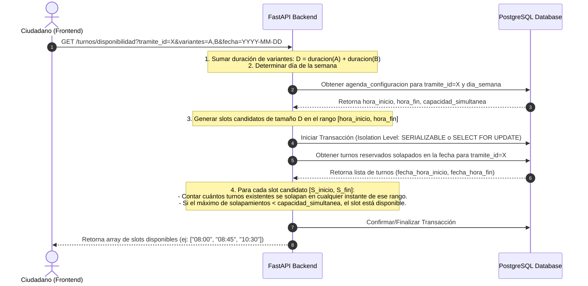
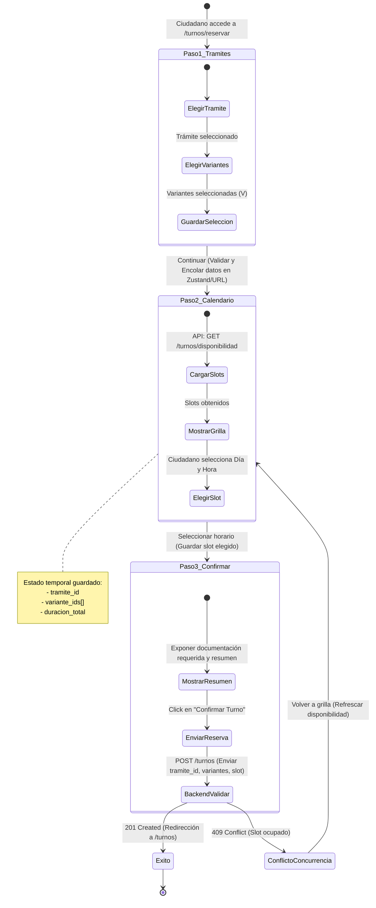

# Hoja de Ruta de Desarrollo Incremental (Micro-Slices Verticales)
> Sistema: **Turnero** — Municipalidad de Armstrong
> Tipo de Documento: Planificación de Ejecución de Ingeniería (Alineado con Estándares de Seguridad, Especificaciones de Dominio e Identidad Visual)

Este documento establece la estrategia y secuencia de construcción del sistema Turnero. El desarrollo se realiza mediante la metodología de **Micro-Slices Verticales (Vertical Slices)**. Cada micro-slice representa una funcionalidad acotada de punta a punta: desde la base de datos (con cifrado PII), lógica de negocio, colas asíncronas, auditoría ORM, hasta la interfaz del frontend y pruebas automatizadas, garantizando el cumplimiento estricto de los estándares de ingeniería, seguridad, arquitectura e identidad visual del municipio.

> [!IMPORTANT]
> **Vinculación Obligatoria con la Documentación de Análisis:**
> En cada slice, los agentes de IA y desarrolladores deben consultar y aplicar **en su totalidad** las directrices definidas en el repositorio de documentación:
> - **Estándares de Ingeniería e Identidad:** [identidad-visual.md](../estandares/identidad-visual.md), [arquitectura-frontend.md](../estandares/arquitectura-frontend.md), [infraestructura-seguridad.md](../estandares/infraestructura-seguridad.md), [ingenieria.md](../estandares/ingenieria.md), [modelo-dominio.md](../estandares/modelo-dominio.md).
> - **Especificaciones del Sistema:** [openapi.yaml](../especificaciones/openapi.yaml), [sitemap-rutas.md](../especificaciones/sitemap-rutas.md), [refinados-casos-uso.md](../especificaciones/refinados-casos-uso.md), [iniciales.md](../especificaciones/iniciales.md).
> - **Dominios Técnicos:** [1-identity.md](../especificaciones/dominios/1-identity.md), [2-catalog.md](../especificaciones/dominios/2-catalog.md), [3-scheduling.md](../especificaciones/dominios/3-scheduling.md), [4-booking.md](../especificaciones/dominios/4-booking.md), [5-operation.md](../especificaciones/dominios/5-operation.md), [6-notifications.md](../especificaciones/dominios/6-notifications.md).

---

## 1. Diagramas Técnicos de Diseño Crítico

### 1.1 Motor de Disponibilidad Concurrente (HU-06 y HU-07)
Este diagrama detalla cómo el Backend calcula las ranuras (slots) disponibles para un trámite que requiere múltiples variantes concurrentes, previniendo condiciones de carrera con bloqueos a nivel de base de datos.
*(Referencia: [4-booking.md](../especificaciones/dominios/4-booking.md) y [infraestructura-seguridad.md](../estandares/infraestructura-seguridad.md))*

### 1.2 Flujo de Datos y Estados del Stepper de Reserva (Frontend)
Describe la navegación paso a paso y la persistencia temporal de la reserva en el Frontend de Next.js antes de enviar la confirmación final al Backend.
*(Referencia: [arquitectura-frontend.md](../estandares/arquitectura-frontend.md) y [identidad-visual.md](../estandares/identidad-visual.md))*

---

## 2. Hoja de Ruta del Desarrollo (Checklist de 11 Micro-Slices)

### [x] Slice 1: Infraestructura Base, Setup (Boilerplate) y CORS
*Meta: Establecer el entorno de desarrollo multi-contenedor y los cimientos de ambos repositorios con integración inicial y seguridad básica.*
* **Documentación de Referencia Obligatoria:**
  - [infraestructura-seguridad.md](../estandares/infraestructura-seguridad.md) (PostgreSQL 18, Redis 8, CORS, Pydantic Settings).
  - [ingenieria.md](../estandares/ingenieria.md) (Estructura de proyectos FastAPI y Next.js 16, reglas de lint).
  - [identidad-visual.md](../estandares/identidad-visual.md) y [arquitectura-frontend.md](../estandares/arquitectura-frontend.md) (Tokens cromáticos `#FE8F00`, `#F0F2F5`, `#333333`, fuente Montserrat).
* **Infraestructura (`docker-compose`):**
  - [x] Levantar base de datos PostgreSQL 18.
  - [x] Levantar servicio Redis 8 (para almacenamiento de caché en memoria e invalidación de tokens/blacklist).
* **Backend (`turnero_api`):**
  - [x] Crear estructura básica de FastAPI (carpetas modularizadas: `app/api`, `app/models`, `app/schemas`, `app/services`, `app/core`).
  - [x] Configurar variables de entorno estrictas con Pydantic Settings (`.env` con claves JWT, URIs de DB, secretos criptográficos).
  - [x] Configurar políticas estrictas de CORS (restringiendo a los orígenes del dominio oficial y local, métodos permitidos GET, POST, DELETE, OPTIONS).
  - [x] Inicializar Alembic y configurar el archivo de migración base.
  - [x] Escribir una ruta de Health Check (`GET /api/v1/health`) y probar que la conexión a PostgreSQL y Redis funcione.
* **Frontend (`turnero`):**
  - [x] Inicializar la aplicación Next.js 16 con TypeScript 7, App Router, ESLint v10 y Tailwind CSS v4.
  - [x] Configurar variables de entorno y cliente HTTP base (`api-client.ts`).
  - [x] Crear layouts y barra de navegación común respetando los tokens de identidad visual oficial.

---

### [x] Slice 2: Identidad, Autenticación y Usurpaciones (Con Cifrado PII)
*Meta: Permitir a los usuarios registrarse, iniciar sesión con cookies seguras, auditar reportes de DNI en conflicto y proteger los datos en reposo.*
* **Documentación de Referencia Obligatoria:**
  - [1-identity.md](../especificaciones/dominios/1-identity.md) (Dominio de Identidad, Autenticación y Usurpaciones: HU-01, HU-02, HU-03, HU-04, HU-27, HU-28).
  - [infraestructura-seguridad.md](../estandares/infraestructura-seguridad.md) (Cifrado Fernet AES-256 PII, HMAC-SHA256 DNI, cookies HttpOnly JWT `session`).
  - [modelo-dominio.md](../estandares/modelo-dominio.md) (Tablas `roles`, `usuarios`, `reportes_usurpacion_dni`).
  - [identidad-visual.md](../estandares/identidad-visual.md) y [arquitectura-frontend.md](../estandares/arquitectura-frontend.md) (Componentes `Button`, `Input`, `Card`, `ReporteDniModal`).
  - [openapi.yaml](../especificaciones/openapi.yaml) (Endpoints `/auth/register`, `/auth/tokens`, `/auth/password-recovery-tokens`, `/auth/password-resets`, `/usuarios/me`, `/usuarios`, `/reportes-usurpacion`, `/admin/reportes-usurpacion`).
* **Backend (`turnero_api`):**
  - [x] Crear tablas `roles`, `usuarios` y `reportes_usurpacion_dni` en las migraciones de Alembic.
  - [x] **Cifrado en Reposo (PII):** Implementar lógica para encriptar mediante **AES-256** los campos de DNI y Teléfono en la base de datos.
  - [x] **Búsqueda Segura:** Crear una columna indexada que almacene un **hash criptográfico de una sola vía (HMAC con sal fija)** para búsquedas rápidas por DNI (registro y login).
  - [x] **Enmascaramiento (Data Masking):** Crear esquemas Pydantic que enmascaren por defecto el DNI y el Teléfono (ej: `XX.XXX.789`) en las respuestas de la API, a menos que el usuario sea administrativo.
  - [x] Implementar hashing de contraseñas con `bcrypt` y firma de tokens JWT (expiración de 24 horas).
  - [x] Crear endpoints `/auth/register` (con validación de DNI/email únicos y política de contraseñas).
  - [x] Crear endpoints `/auth/tokens` (login/logout que manejen cookies HttpOnly JWT `session` y registren los tokens revocados en la lista negra de Redis con TTL).
  - [x] Crear endpoints para recuperación y reseteo de contraseña (`/auth/password-recovery-tokens`, `/auth/password-resets`).
  - [x] Crear endpoints de perfil y búsqueda de usuarios (`/usuarios/me`, `/usuarios`).
  - [x] Crear endpoints para reportes de usurpación de DNI (`POST /reportes-usurpacion` público con nombre/apellido del denunciante y `GET/PATCH /admin/reportes-usurpacion` protegido).
  - [x] Escribir tests de integración de API y unitarios para seguridad y autenticación.
* **Frontend (`turnero`):**
  - [x] Crear páginas públicas de `/auth/login`, `/auth/register` y `/auth/recuperar-password`.
  - [x] Implementar middleware de Next.js (`middleware.ts`) para protección de rutas según la cookie de sesión `session`.
  - [x] Diseñar el modal `ReporteDniModal` en `/auth/register` si el DNI ya existe (capturando datos del denunciante).

---

### [ ] Slice 3: Catálogo - ABM de Áreas y Trámites con Emisión de Carnet (`catalog`)
*Meta: Permitir al personal administrativo crear, modificar y listar Áreas Municipales y Trámites definiendo su límite de sobreturnos diarios y la emisión de carnet.*
* **Documentación de Referencia Obligatoria:**
  - [2-catalog.md](../especificaciones/dominios/2-catalog.md#L11-L14) (HU-14: Configuración de catálogo de trámites y áreas, límite de sobreturnos, emisión de carnet).
  - [modelo-dominio.md](../estandares/modelo-dominio.md) (Entidades `Area` y `Tramite`).
  - [openapi.yaml](../especificaciones/openapi.yaml) (Endpoints `/areas`, `/tramites`, `/admin/areas`, `/admin/tramites`).
  - [sitemap-rutas.md](../especificaciones/sitemap-rutas.md#L29) (Ruta `/admin/tramites`).
  - [identidad-visual.md](../estandares/identidad-visual.md) y [arquitectura-frontend.md](../estandares/arquitectura-frontend.md) (Componentes `Card`, `Table`, `Modal`, `Button`).
* **Backend (`turnero_api`):**
  - [ ] Crear modelos SQLAlchemy `Area` y `Tramite` con relaciones y migración de Alembic.
  - [ ] Crear esquemas Pydantic v2 `AreaCreate`, `AreaResponse`, `TramiteCreate`, `TramiteResponse`.
  - [ ] Crear endpoints públicos `GET /areas` y `GET /tramites` (filtrados por área).
  - [ ] Crear endpoints administrativos protegidos `POST/PUT/DELETE /admin/areas` y `POST/PUT/DELETE /admin/tramites`.
  - [ ] Escribir tests unitarios y de integración para la creación y gestión de áreas y trámites.
* **Frontend (`turnero`):**
  - [ ] Crear vista administrativa `/admin/tramites` con listado de áreas y trámites.
  - [ ] Implementar modales de creación y edición de Áreas y Trámites (con checkboxes para `emite_carnet` e input numérico para `limite_sobreturnos_diarios`).

---

### [ ] Slice 4: Catálogo - Variantes, Documentación Markdown, Enlaces y Archivos PDF (`catalog`)
*Meta: Asignar variantes de duración a cada trámite, redactar requerimientos en Markdown, configurar enlaces externos y subir archivos PDF de formularios.*
* **Documentación de Referencia Obligatoria:**
  - [2-catalog.md](../especificaciones/dominios/2-catalog.md#L15-L24) (HU-17: Documentación requerida en Markdown, HU-26: Requerimientos previos, enlaces útiles y adjuntos PDF).
  - [modelo-dominio.md](../estandares/modelo-dominio.md) (Entidades `Variante`, `TramiteDocumento`, `TramiteEnlace`).
  - [infraestructura-seguridad.md](../estandares/infraestructura-seguridad.md) (Almacenamiento seguro de archivos locales y sanitización).
  - [openapi.yaml](../especificaciones/openapi.yaml) (Endpoints `/tramites/{id}/variantes`, `/tramites/{id}/documentos`, `/tramites/{id}/enlaces`).
  - [arquitectura-frontend.md](../estandares/arquitectura-frontend.md) (Renderizado y sanitización de Markdown en cliente).
* **Backend (`turnero_api`):**
  - [ ] Crear modelos SQLAlchemy `Variante`, `TramiteDocumento` y `TramiteEnlace` con eliminación en cascada y limpieza de archivos en disco.
  - [ ] Implementar endpoint multipart `POST /admin/tramites/{id}/documentos` para subir archivos PDF/DOCX de formularios al almacenamiento local.
  - [ ] Implementar endpoints CRUD para Variantes de trámite y Enlaces útiles.
  - [ ] Escribir tests de integración verificando la carga de adjuntos y la eliminación en cascada.
* **Frontend (`turnero`):**
  - [ ] Añadir a la vista `/admin/tramites` el editor de Markdown para documentación requerida e instrucciones.
  - [ ] Añadir gestor de variantes de duración por trámite (ej: "Examen Teórico - 15 min").
  - [ ] Implementar sección de carga de archivos descargables y configuración de links útiles.

---

### [ ] Slice 5: Agendamiento - Configuración de Agenda Semanal y Capacidad Simultánea (`scheduling`)
*Meta: Permitir al personal administrativo configurar los horarios de atención semanal por trámite (días 0-6, hora inicio, hora fin) y la cantidad de ventanillas concurrentes.*
* **Documentación de Referencia Obligatoria:**
  - [3-scheduling.md](../especificaciones/dominios/3-scheduling.md#L10-L17) (HU-18: Registrar horarios y fechas de la agenda semanal por trámite, regla `hora_fin > hora_inicio` y `capacidad_simultanea`).
  - [modelo-dominio.md](../estandares/modelo-dominio.md) (Entidad `AgendaConfiguracion`).
  - [infraestructura-seguridad.md](../estandares/infraestructura-seguridad.md) (Caché Redis para reglas de agenda TTL 1h).
  - [openapi.yaml](../especificaciones/openapi.yaml) (Endpoints `/agendas`, `/admin/agendas`).
  - [sitemap-rutas.md](../especificaciones/sitemap-rutas.md#L30) (Ruta `/admin/agenda`).
* **Backend (`turnero_api`):**
  - [ ] Crear modelo SQLAlchemy `AgendaConfiguracion` (campos: `tramite_id`, `dia_semana`, `hora_inicio`, `hora_fin`, `capacidad_simultanea`, `activo`).
  - [ ] Validar en el servicio que `hora_fin` sea posterior a `hora_inicio` y `capacidad_simultanea >= 1`.
  - [ ] Crear endpoints `GET /agendas/{tramite_id}` y `PUT /admin/agendas/{tramite_id}`.
  - [ ] Implementar almacenamiento en caché Redis (TTL 1h) con invalidación automática ante cambios.
  - [ ] Escribir tests unitarios para las reglas de validación de agenda.
* **Frontend (`turnero`):**
  - [ ] Crear la vista administrativa `/admin/agenda` con selector de trámite.
  - [ ] Implementar tabla interactiva de los 7 días de la semana para habilitar/deshabilitar días y configurar horas y capacidad simultánea.

---

### [ ] Slice 6: Reservas - Motor de Disponibilidad Horaria y Stepper en 2 Pasos (`booking`)
*Meta: Calcular en tiempo real los slots horarios libres para una combinación de variantes de un trámite y ofrecer la función "Primer Turno Disponible".*
* **Documentación de Referencia Obligatoria:**
  - [4-booking.md](../especificaciones/dominios/4-booking.md#L10-L25) (HU-05: Elección de trámite/variantes, HU-06: Selección múltiple, HU-07: Ver disponibilidad horaria, HU-08: Primer turno disponible).
  - [4-booking.md](../especificaciones/dominios/4-booking.md#L50-L95) (Diagrama de secuencia y algoritmo de suma de duraciones y solapamientos).
  - [openapi.yaml](../especificaciones/openapi.yaml) (Endpoints `GET /turnos/disponibilidad` y `GET /turnos/primer-disponible`).
  - [arquitectura-frontend.md](../estandares/arquitectura-frontend.md) (Componentes `CartVariantes`, `GrillaSlots`, stepper de reserva).
* **Backend (`turnero_api`):**
  - [ ] Crear el servicio `AvailabilityService` con el algoritmo de cálculo de slots respetando `capacidad_simultanea` y duraciones acumuladas.
  - [ ] Validar que todas las variantes enviadas pertenezcan obligatoriamente al mismo trámite.
  - [ ] Implementar algoritmo de búsqueda del "Primer turno disponible" inspeccionando hasta 30 días futuros.
  - [ ] Crear endpoints `GET /turnos/disponibilidad` y `GET /turnos/primer-disponible`.
  - [ ] Escribir tests del motor de disponibilidad con distintos escenarios de solapamiento.
* **Frontend (`turnero`):**
  - [ ] Crear el flujo Stepper en `/turnos/reservar`:
    - **Paso 1:** Selector de Trámite y variantes acumulativas mediante `CartVariantes`.
    - **Paso 2:** Calendario interactivo y `GrillaSlots` de horarios libres devueltos por la API.
    - Botón de "Primer turno disponible" para auto-seleccionar la cita más próxima.

---

### [ ] Slice 7: Reservas - Creación Atómica, Mi Panel de Turnos y Cancelaciones (`booking`)
*Meta: Ejecutar la transacción de reserva con prevención de sobre-reservas (condición de carrera), visualizar "Mi Panel" de turnos y gestionar cancelaciones y reprogramaciones.*
* **Documentación de Referencia Obligatoria:**
  - [4-booking.md](../especificaciones/dominios/4-booking.md#L26-L45) (HU-10: Reprogramar turno, HU-11: Cancelación con anticipación mínima de 24h, HU-12: Panel del ciudadano).
  - [4-booking.md](../especificaciones/dominios/4-booking.md#L95-L140) (Aislamiento `SERIALIZABLE` / `SELECT ... FOR UPDATE` y máquina de estados del Stepper).
  - [openapi.yaml](../especificaciones/openapi.yaml) (Endpoints `POST /turnos`, `GET /turnos/mis-turnos`, `DELETE /turnos/{id}`, `PATCH /turnos/{id}/reprogramar`).
  - [sitemap-rutas.md](../especificaciones/sitemap-rutas.md#L21) (Ruta `/turnos`).
* **Backend (`turnero_api`):**
  - [ ] Crear modelos SQLAlchemy `Turno` y `TurnoVariante` con migración de Alembic.
  - [ ] Implementar la transacción de reserva en `POST /turnos` bajo nivel de aislamiento `SERIALIZABLE` o `SELECT FOR UPDATE` (retornando `409 Conflict` si ocurre una colisión).
  - [ ] Implementar endpoint `GET /turnos/mis-turnos` para el ciudadano autenticado.
  - [ ] Implementar endpoints `DELETE /turnos/{id}` (cancelación) y `PATCH /turnos/{id}/reprogramar`, verificando la regla de anticipación mínima de 24 horas.
  - [ ] Escribir tests de concurrencia simulando solicitudes de reserva simultáneas sobre el mismo slot.
* **Frontend (`turnero`):**
  - [ ] Completar el **Paso 3** del Stepper `/turnos/reservar` con el resumen de la cita, lista de documentos a llevar y botón de confirmación final.
  - [ ] Manejar el error `409 Conflict` devolviendo al usuario al Paso 2 sin perder su selección.
  - [ ] Crear la vista `/turnos` ("Mi Panel") con pestañas "Próximos Turnos" e "Historial" y botones para cancelar/reprogramar.

---

### [ ] Slice 8: Operación - Tablero de Cola del Día y Cierre de Atenciones (`operation`)
*Meta: Proveer el panel de ventanilla en tiempo real para visualizar la cola de turnos del día, registrar la asistencia (Completo, Incompleto, Ausente) y emitir carnets.*
* **Documentación de Referencia Obligatoria:**
  - [5-operation.md](../especificaciones/dominios/5-operation.md#L16-L23) (HU-20: Cerrar turno registrando resultado y emisión de carnet si corresponde).
  - [5-operation.md](../especificaciones/dominios/5-operation.md#L32-L60) (Máquina de estados de `Turno`: `RESERVADO`, `COMPLETO`, `INCOMPLETO`, `AUSENTE`, `CANCELADO`).
  - [modelo-dominio.md](../estandares/modelo-dominio.md) (Entidad `Carnet` con encriptación Fernet AES-256 en `numero_carnet`).
  - [openapi.yaml](../especificaciones/openapi.yaml) (Endpoints `/admin/dashboard/cola`, `/admin/turnos/{id}/resultado`).
  - [sitemap-rutas.md](../especificaciones/sitemap-rutas.md#L26) (Ruta `/admin/dashboard`).
* **Backend (`turnero_api`):**
  - [ ] Crear modelo SQLAlchemy `Carnet` con cifrado Fernet AES-256 en el campo `numero_carnet`.
  - [ ] Crear endpoint `GET /admin/dashboard/cola` para obtener los turnos del día ordenados cronológicamente.
  - [ ] Crear endpoint `PATCH /admin/turnos/{id}/resultado` que permita actualizar el estado a `COMPLETO`, `INCOMPLETO` (requiriendo `resultado_comentario`) o `AUSENTE`.
  - [ ] Si el estado es `COMPLETO` y el trámite tiene `emite_carnet = true`, exigir `numero_carnet` y `fecha_vencimiento` e insertar el registro histórico en `carnets`.
  - [ ] Escribir tests de integración para el cierre de turnos y emisión de carnets.
* **Frontend (`turnero`):**
  - [ ] Crear la vista del panel de ventanilla `/admin/dashboard`.
  - [ ] Implementar componente `AtendedorTurno` con botones rápidos para marcar Completo, Incompleto (con modal de observaciones) y Ausente.
  - [ ] Desplegar campos para ingreso de número y vencimiento de carnet al completar trámites que lo requieran.

---

### [ ] Slice 9: Operación - Sobretornos con Prioridad y Agendamiento Manual (`operation` & `booking`)
*Meta: Permitir la carga de sobreturnos con prioridades (Alta, Media, Baja) respetando el límite diario y la carga de turnos presenciales con registro "al vuelo" de ciudadanos.*
* **Documentación de Referencia Obligatoria:**
  - [5-operation.md](../especificaciones/dominios/5-operation.md#L10-L15) (HU-19: Cargar sobreturnos con prioridad y validación del límite diario `limite_sobreturnos_diarios`).
  - [4-booking.md](../especificaciones/dominios/4-booking.md#L38-L45) (HU-15: Cargar turnos manualmente con registro de ciudadano al vuelo en `PENDING_VALIDATION`, HU-16: Editar turnos).
  - [openapi.yaml](../especificaciones/openapi.yaml) (Endpoints `/admin/sobreturnos`, `/admin/turnos/manual`, `/admin/turnos`).
  - [sitemap-rutas.md](../especificaciones/sitemap-rutas.md#L27-L28) (Rutas `/admin/turnos` y `/admin/turnos/nuevo`).
* **Backend (`turnero_api`):**
  - [ ] Implementar endpoint `POST /admin/sobreturnos` validando que la cantidad de sobreturnos del día no supere `limite_sobreturnos_diarios` del trámite.
  - [ ] Actualizar el ordenamiento de la cola diaria (`GET /admin/dashboard/cola`) agrupando sobreturnos al final, ordenados por Prioridad (`ALTA` > `MEDIA` > `BAJA`) y FIFO (`created_at`).
  - [ ] Implementar endpoint `POST /admin/turnos/manual` que busque un ciudadano por DNI (vía HMAC) o lo cree al vuelo en estado `PENDING_VALIDATION`.
  - [ ] Crear buscador global de turnos `GET /admin/turnos` para operadores.
  - [ ] Escribir tests unitarios y de integración para sobreturnos y agendamiento manual.
* **Frontend (`turnero`):**
  - [ ] Crear formulario modal para solicitar sobreturno con selector de prioridad (`PrioritySelector`).
  - [ ] Crear la vista de carga manual `/admin/turnos/nuevo` con buscador rápido por DNI (`BuscadorCiudadano`).
  - [ ] Crear la vista de buscador global de turnos `/admin/turnos`.

---

### [ ] Slice 10: Notificaciones - Generación de Planilla PDF y Despacho Asíncrono (`notifications`)
*Meta: Despachar notificaciones de confirmación por email (SMTP) y WhatsApp (mock) en segundo plano mediante Celery/Redis, y generar la planilla del turno en PDF.*
* **Documentación de Referencia Obligatoria:**
  - [6-notifications.md](../especificaciones/dominios/6-notifications.md#L9-L20) (HU-09: Confirmación por email, WhatsApp y notificación interna, HU-25: Descargar planilla PDF y adjuntos).
  - [infraestructura-seguridad.md](../estandares/infraestructura-seguridad.md) (Celery con Redis, tareas asíncronas desvinculadas de la petición HTTP, SMTP STARTTLS/SMTPS).
  - [modelo-dominio.md](../estandares/modelo-dominio.md) (Entidad `Notificacion`).
  - [openapi.yaml](../especificaciones/openapi.yaml) (Endpoints `GET /turnos/{id}/planilla`, `GET /usuarios/me/notificaciones`).
* **Backend (`turnero_api`):**
  - [ ] Crear modelo SQLAlchemy `Notificacion` con migración de Alembic.
  - [ ] Configurar Celery con broker Redis para procesamiento asíncrono en segundo plano (`BackgroundTasks` o Celery worker).
  - [ ] Crear servicio de generación de planilla PDF (incluyendo datos de la cita, DNI descifrado y lista de documentación requerida).
  - [ ] Desarrollar servicio de envío de email SMTP (STARTTLS) y cliente HTTP mockable para WhatsApp.
  - [ ] Crear endpoints `GET /turnos/{id}/planilla` y `GET /usuarios/me/notificaciones`.
  - [ ] Escribir tests para la generación de PDF y encolamiento de tareas.
* **Frontend (`turnero`):**
  - [ ] Añadir botón "Descargar Planilla" en el comprobante del turno y en el panel del ciudadano.
  - [ ] Implementar componente de Notificaciones (campana visual) en la barra de navegación para alertas internas.

---

### [ ] Slice 11: Configuración Global y Gestión de Cuentas Administrativas (`identity` & `operation`)
*Meta: Proveer al Administrador General el control de parámetros globales del sistema y la administración de usuarios del personal.*
* **Documentación de Referencia Obligatoria:**
  - [1-identity.md](../especificaciones/dominios/1-identity.md#L32-L39) (HU-23: Crear cuentas administrativas con contraseña temporal, HU-24: Dar de baja administrativos).
  - [5-operation.md](../especificaciones/dominios/5-operation.md#L23-L29) (HU-21: Editar variables de `configuracion_global`, HU-22: Cuenta sembrada de administrador).
  - [modelo-dominio.md](../estandares/modelo-dominio.md) (Entidad `ConfiguracionGlobal`).
  - [openapi.yaml](../especificaciones/openapi.yaml) (Endpoints `/admin/configuracion`, `/admin/administrativos`).
  - [sitemap-rutas.md](../especificaciones/sitemap-rutas.md#L32-L35) (Rutas `/admin/configuracion` y `/admin/administrativos`).
* **Backend (`turnero_api`):**
  - [ ] Crear modelo SQLAlchemy `ConfiguracionGlobal` y sembrar valores por defecto (ej: `anticipacion_cancelacion_horas = 24`).
  - [ ] Sembrar en la inicialización la cuenta por defecto del `ADMINISTRADOR`.
  - [ ] Crear endpoints `GET/PATCH /admin/configuracion` (acceso exclusivo: `administrador`).
  - [ ] Crear endpoints `POST/GET/DELETE /admin/administrativos` (generando contraseña temporal en la creación y cambiando a `INACTIVE` en la baja).
  - [ ] Escribir tests de integración para el panel de administración global.
* **Frontend (`turnero`):**
  - [ ] Crear la vista `/admin/configuracion` para editar parámetros globales.
  - [ ] Crear la vista `/admin/administrativos` para listar, dar de alta y dar de baja personal de atención.
