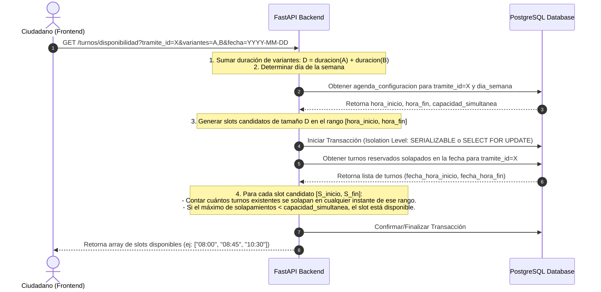
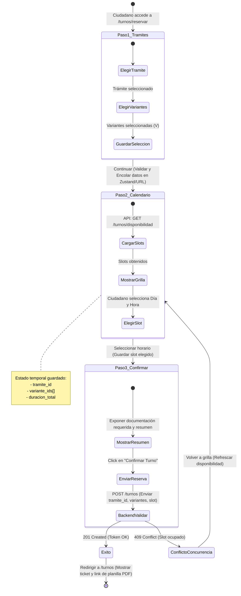

# Hoja de Ruta de Desarrollo Incremental (Slices Verticales)
> Sistema: **Turnero** — Municipalidad de Armstrong
> Tipo de Documento: Planificación de Ejecución de Ingeniería

Este documento establece la estrategia y secuencia de construcción del sistema Turnero. El desarrollo se realiza mediante la metodología de **Slices Verticales (Vertical Slices)**. Cada slice representa una funcionalidad completa de punta a punta: desde la base de datos hasta la interfaz del frontend y pruebas automatizadas, minimizando los riesgos de integración tardía.

---

## 1. Diagramas Técnicos de Diseño Crítico

### 1.1 Motor de Disponibilidad Concurrente (HU-06 y HU-07)
Este diagrama detalla cómo el Backend calcula las ranuras (slots) disponibles para un trámite que requiere múltiples variantes concurrentes, previniendo condiciones de carrera.

### 1.2 Flujo de Datos y Estados del Stepper de Reserva (Frontend)
Describe la navegación paso a paso y la persistencia temporal de la reserva en el Frontend de Next.js antes de enviar la confirmación final al Backend.

---

## 2. Hoja de Ruta del Desarrollo (Checklist por Slices)

### [ ] Slice 1: Infraestructura Base y Boilerplate
*Meta: Establecer el entorno de desarrollo y los cimientos de ambos repositorios con integración inicial.*
* **Backend (`turnero_api`):**
  - [ ] Crear estructura básica de FastAPI (carpetas modularizadas: `app/core`, `app/api`, `app/models`, `app/schemas`).
  - [ ] Configurar archivo `Dockerfile` y `docker-compose.yml` para levantar la base de datos PostgreSQL localmente.
  - [ ] Inicializar Alembic y configurar el archivo de migración base.
  - [ ] Configurar variables de entorno mediante Pydantic Settings (`.env`).
  - [ ] Escribir una ruta de Health Check (`GET /api/v1/health`) y probar que la conexión a PostgreSQL funcione.
* **Frontend (`turnero`):**
  - [ ] Inicializar la aplicación Next.js 14+ con TypeScript, App Router, ESLint y Tailwind CSS.
  - [ ] Configurar variables de entorno y cliente HTTP base (Axios o fetch estructurado).
  - [ ] Crear layouts y barra de navegación común.

---

### [ ] Slice 2: Identidad, Autenticación y Usurpaciones
*Meta: Permitir a los usuarios registrarse, iniciar sesión con seguridad y reportar casos de DNI duplicado.*
* **Backend (`turnero_api`):**
  - [ ] Crear tablas `roles`, `usuarios` y `reportes_usurpacion_dni` en las migraciones de Alembic.
  - [ ] Implementar hashing de contraseñas con `bcrypt`.
  - [ ] Crear endpoints `/auth/register` (con validación de DNI/email únicos).
  - [ ] Crear endpoints `/auth/tokens` (login/logout que manejen cookies HttpOnly JWT).
  - [ ] Crear endpoints para reportes de usurpación de DNI (`POST /auth/usurpaciones` para reportar, y `GET/PATCH /admin/usurpaciones` protegido para administrativos).
  - [ ] Escribir tests de integración de API para registrarse, loguearse y reportar usurpaciones.
* **Frontend (`turnero`):**
  - [ ] Crear páginas públicas de `/auth/login`, `/auth/register` y `/auth/recuperar-password`.
  - [ ] Implementar middleware de Next.js para protección de rutas según el rol decodificado del JWT.
  - [ ] Diseñar el formulario de reporte de usurpación de DNI al fallar el registro por DNI duplicado.

---

### [ ] Slice 3: Catálogo Municipal y Configuración de Agendas
*Meta: Configurar las áreas municipales, trámites, duraciones y horarios de atención.*
* **Backend (`turnero_api`):**
  - [ ] Crear tablas `areas`, `tramites`, `variantes` y `agenda_configuracion`.
  - [ ] Desarrollar CRUD completo para áreas, trámites y variantes (accesibles solo por administrador/administrativo).
  - [ ] Desarrollar CRUD para configuración de agenda semanal (`agenda_configuracion`) por trámite.
  - [ ] Escribir tests para verificar las restricciones lógicas de agenda (ej. `hora_fin > hora_inicio`).
* **Frontend (`turnero`):**
  - [ ] Crear el panel administrativo `/admin/tramites` para ver y editar el catálogo.
  - [ ] Crear el panel `/admin/agenda` para configurar bloques de atención y capacidad simultánea por día.

---

### [ ] Slice 4: Motor de Reservas y Disponibilidad (Core)
*Meta: Implementar el algoritmo de búsqueda de turnos y permitir la reserva de citas ordinarias por ciudadanos.*
* **Backend (`turnero_api`):**
  - [ ] Crear tablas `turnos` y `turnos_variantes`.
  - [ ] Programar el endpoint `GET /api/v1/turnos/disponibilidad` que sume la duración de variantes seleccionadas y evalúe la capacidad simultánea sin solapamientos.
  - [ ] Implementar control de concurrencia optimista/pesimista para la reserva simultánea del mismo bloque.
  - [ ] Desarrollar endpoint `POST /api/v1/turnos` para crear la reserva ordinaria.
  - [ ] Programar algoritmo de "Primer turno disponible".
  - [ ] Escribir tests de concurrencia y de validación de slots libres con múltiples variantes.
* **Frontend (`turnero`):**
  - [ ] Implementar el Stepper en `/turnos/reservar`:
    - Paso 1: Selección de trámite y variantes (Carrito de variantes).
    - Paso 2: Selección de fecha y hora interactivo mediante grilla de slots.
    - Paso 3: Confirmación y visualización de requerimientos previos.

---

### [ ] Slice 5: Gestión Operativa y Sobretornos
*Meta: Permitir a los administrativos visualizar la cola diaria del municipio y agregar sobreturnos con prioridad.*
* **Backend (`turnero_api`):**
  - [ ] Programar endpoint `GET /api/v1/admin/dashboard/cola` para ver turnos del día filtrados por área, ordenando los sobreturnos según prioridad (Alta > Media > Baja) y fecha de creación.
  - [ ] Implementar endpoint de carga manual de turnos/sobreturnos (`POST /api/v1/admin/turnos/manual` que permita registrar al ciudadano al vuelo si no existe).
  - [ ] Validar el límite diario de sobreturnos definido en el trámite.
* **Frontend (`turnero`):**
  - [ ] Diseñar el dashboard `/admin/dashboard` con la vista de cola del día actual y actualización en tiempo real.
  - [ ] Diseñar el panel de carga manual `/admin/turnos/nuevo` con buscador rápido por DNI y selección de sobreturno con selector de prioridad.

---

### [ ] Slice 6: Cierre de Turnos y Registro de Carnets
*Meta: Permitir a los administrativos registrar el resultado de la atención y guardar el registro histórico de carnets emitidos.*
* **Backend (`turnero_api`):**
  - [ ] Crear la tabla `carnets`.
  - [ ] Implementar transiciones de estado de `Turno` en endpoint `PATCH /api/v1/turnos/{id}` (marcar Completo, Incompleto con comentario o Ausente).
  - [ ] Si el resultado es Completo y el trámite tiene `emite_carnet = true`, validar que se ingrese la fecha de vencimiento e insertar el carnet en la base de datos de manera histórica.
  - [ ] Implementar endpoints para reprogramación y cancelación de turnos, validando anticipación de cancelación configurada globalmente.
* **Frontend (`turnero`):**
  - [ ] Agregar controles en `/admin/dashboard` para cambiar el estado del turno (Marcar como Asistido con modal de resultado, Incompleto o Ausente).
  - [ ] Agregar vista `/admin/turnos` para buscar turnos históricos y reprogramar/cancelar.
  - [ ] Crear la sección "Mi Panel" (`/turnos`) del ciudadano donde pueda ver sus turnos reservados y cancelarlos/reprogramarlos si cumple con la anticipación mínima.

---

### [ ] Slice 7: Notificaciones Asíncronas y Planillas PDF
*Meta: Enviar confirmaciones y planillas en formato PDF sin bloquear la ejecución de la API.*
* **Backend (`turnero_api`):**
  - [ ] Configurar un sistema de envío asíncrono usando las Background Tasks de FastAPI.
  - [ ] Desarrollar el generador de PDF para la planilla del turno (`USU-09`).
  - [ ] Implementar servicios mockables para el envío de notificaciones por Correo Electrónico (SMTP) y WhatsApp (simulación de integración con la API del municipio).
  - [ ] Integrar las notificaciones automáticas en los flujos de creación, cancelación y reprogramación de turnos.
* **Frontend (`turnero`):**
  - [ ] Añadir botones de descarga de PDF tanto en la confirmación de reserva como en el panel principal del ciudadano y el administrativo.
