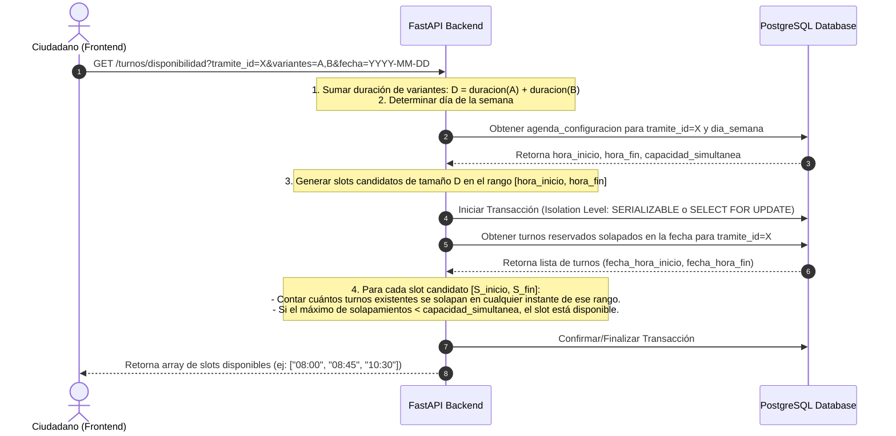
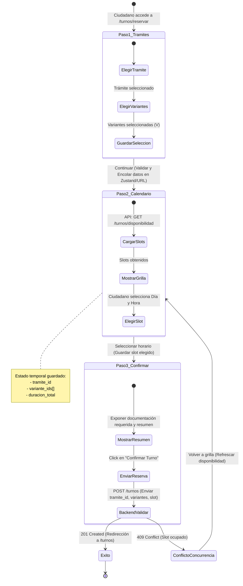

# Hoja de Ruta de Desarrollo Incremental (Slices Verticales)
> Sistema: **Turnero** — Municipalidad de Armstrong
> Tipo de Documento: Planificación de Ejecución de Ingeniería (Alineado con Estándares de Seguridad e Infraestructura)

Este documento establece la estrategia y secuencia de construcción del sistema Turnero. El desarrollo se realiza mediante la metodología de **Slices Verticales (Vertical Slices)**. Cada slice representa una funcionalidad completa de punta a punta: desde la base de datos (con cifrado PII), lógica de negocio, colas asíncronas, auditoría ORM, hasta la interfaz del frontend y pruebas automatizadas, garantizando el cumplimiento estricto de los estándares de ingeniería, seguridad e infraestructura del municipio.

> [!IMPORTANT]
> **Metodología de Trabajo y Git:**
> Los cambios deben implementarse y commitearse de manera incremental (de a poco) a medida que se avance en el desarrollo. Es obligatorio ramificar (crear ramas/branches independientes) para cada slice o funcionalidad cuando sea necesario, asegurando un flujo de trabajo ordenado e integrable.

---

## 1. Diagramas Técnicos de Diseño Crítico

### 1.1 Motor de Disponibilidad Concurrente (HU-06 y HU-07)
Este diagrama detalla cómo el Backend calcula las ranuras (slots) disponibles para un trámite que requiere múltiples variantes concurrentes, previniendo condiciones de carrera con bloqueos a nivel de base de datos.

### 1.2 Flujo de Datos y Estados del Stepper de Reserva (Frontend)
Describe la navegación paso a paso y la persistencia temporal de la reserva en el Frontend de Next.js antes de enviar la confirmación final al Backend.

---

## 2. Hoja de Ruta del Desarrollo (Checklist por Slices)

### [ ] Slice 1: Infraestructura Base, Setup (Boilerplate) y CORS
*Meta: Establecer el entorno de desarrollo multi-contenedor y los cimientos de ambos repositorios con integración inicial y seguridad básica.*
* **Infraestructura (`docker-compose`):**
  - [ ] Levantar base de datos PostgreSQL 18.
  - [ ] Levantar servicio Redis 8 (para almacenamiento de caché en memoria e invalidación de tokens/blacklist).
* **Backend (`turnero_api`):**
  - [ ] Crear estructura básica de FastAPI (carpetas modularizadas: `app/api`, `app/models`, `app/schemas`, `app/services`, `app/core`).
  - [ ] Configurar variables de entorno estrictas con Pydantic Settings (`.env` con claves JWT, URIs de DB, secretos criptográficos).
  - [ ] Configurar políticas estrictas de CORS (restringiendo a los orígenes del dominio oficial y local, métodos permitidos GET, POST, DELETE, OPTIONS).
  - [ ] Inicializar Alembic y configurar el archivo de migración base.
  - [ ] Escribir una ruta de Health Check (`GET /api/v1/health`) y probar que la conexión a PostgreSQL y Redis funcione.
* **Frontend (`turnero`):**
  - [ ] Inicializar la aplicación Next.js 16 con TypeScript 7, App Router, ESLint v10 y Tailwind CSS v4.
  - [ ] Configurar variables de entorno y cliente HTTP base (Axios o fetch estructurado).
  - [ ] Crear layouts y barra de navegación común.

---

### [ ] Slice 2: Identidad, Autenticación y Usurpaciones (Con Cifrado PII)
*Meta: Permitir a los usuarios registrarse, iniciar sesión con cookies seguras, auditar reportes de DNI en conflicto y proteger los datos en reposo.*
* **Backend (`turnero_api`):**
  - [ ] Crear tablas `roles`, `usuarios` y `reportes_usurpacion_dni` en las migraciones de Alembic.
  - [ ] **Cifrado en Reposo (PII):** Implementar lógica para encriptar mediante **AES-256** los campos de DNI y Teléfono en la base de datos.
  - [ ] **Búsqueda Segura:** Crear una columna indexada que almacene un **hash criptográfico de una sola vía (HMAC con sal fija)** para búsquedas rápidas por DNI (registro y login).
  - [ ] **Enmascaramiento (Data Masking):** Crear esquemas Pydantic que enmascaren por defecto el DNI y el Teléfono (ej: `XX.XXX.789`) en las respuestas de la API, a menos que el usuario sea administrativo.
  - [ ] Implementar hashing de contraseñas con `bcrypt` y firma de tokens JWT (expiración de 24 horas).
  - [ ] Crear endpoints `/auth/register` (con validación de DNI/email únicos).
  - [ ] Crear endpoints `/auth/tokens` (login/logout que manejen cookies HttpOnly JWT y registren los tokens revocados en la lista negra de Redis con TTL).
  - [ ] Crear endpoints para reportes de usurpación de DNI (`POST /auth/usurpaciones` público y `GET/PATCH /admin/usurpaciones` protegido).
  - [ ] Escribir tests de integración de API para registrarse, loguearse y reportar usurpaciones.
* **Frontend (`turnero`):**
  - [ ] Crear páginas públicas de `/auth/login`, `/auth/register` y `/auth/recuperar-password`.
  - [ ] Implementar middleware de Next.js para protección de rutas según el rol decodificado del JWT en la cookie de sesión.
  - [ ] Diseñar el modal de reporte de usurpación de DNI en `/auth/register` si el DNI ya existe.

---

### [ ] Slice 3: Catálogo Municipal y Configuración de Agendas
*Meta: Configurar las áreas municipales, trámites, duraciones y horarios de atención, e implementar caché de lectura.*
* **Backend (`turnero_api`):**
  - [ ] Crear tablas `areas`, `tramites`, `variantes` y `agenda_configuracion`.
  - [ ] Desarrollar CRUD completo para áreas, trámites y variantes (accesibles solo por administrador/administrativo).
  - [ ] Desarrollar CRUD para configuración de agenda semanal (`agenda_configuracion`) por trámite.
  - [ ] **Caché de lectura (Redis):** Implementar caché para áreas, trámites y variantes (TTL 24h) y configuraciones de agenda (TTL 1h) con invalidación basada en eventos (escrituras limpian la caché correspondiente).
  - [ ] Escribir tests para verificar las restricciones lógicas de agenda (ej. `hora_fin > hora_inicio`).
* **Frontend (`turnero`):**
  - [ ] Crear el panel administrativo `/admin/tramites` para ver y editar el catálogo.
  - [ ] Crear el panel `/admin/agenda` para configurar bloques de atención y capacidad simultánea por día.

---

### [ ] Slice 4: Motor de Reservas y Disponibilidad (Core)
*Meta: Búsqueda y reserva de citas regulada por el cálculo de capacidad y prevención de condiciones de carrera.*
* **Backend (`turnero_api`):**
  - [ ] Crear tablas `turnos` y `turnos_variantes`.
  - [ ] **Restricción de Trámite:** Validar que todas las variantes enviadas en una solicitud pertenezcan al mismo trámite.
  - [ ] Programar el endpoint `GET /api/v1/turnos/disponibilidad` que sume la duración de variantes seleccionadas y evalúe la capacidad simultánea sin solapamientos.
  - [ ] **Prevención de Condiciones de Carrera:** Implementar bloqueo a nivel de fila (`SELECT ... FOR UPDATE` sobre turnos reservados concurrentes en el bloque) dentro de una transacción con aislamiento `SERIALIZABLE` para evitar sobre-reservas.
  - [ ] Desarrollar endpoint `POST /api/v1/turnos` para crear la reserva ordinaria.
  - [ ] Programar algoritmo de "Primer turno disponible" (búsqueda incremental en 30 días).
  - [ ] Escribir tests de concurrencia simulando peticiones simultáneas sobre el mismo slot.
* **Frontend (`turnero`):**
  - [ ] Implementar el Stepper en `/turnos/reservar`:
    - Paso 1: Selección de trámite y variantes (restringido al mismo trámite).
    - Paso 2: Selección de fecha y hora interactivo mediante grilla de slots.
    - Paso 3: Confirmación y visualización de requerimientos previos.
    - Manejo de reintentos: Si la API retorna `409 Conflict`, alertar al ciudadano y recargar disponibilidad del Paso 2.

---

### [ ] Slice 5: Gestión Operativa, Sobretornos y Auditoría ORM
*Meta: Permitir a los administrativos visualizar la cola diaria, agregar sobreturnos con prioridad y registrar automáticamente auditorías.*
* **Backend (`turnero_api`):**
  - [ ] Crear la tabla `auditoria_acciones`.
  - [ ] **Auditoría Automatizada por ORM:** Implementar escuchadores (listeners) de eventos en SQLAlchemy (`before_insert`, `before_update`) para interceptar y registrar automáticamente en `auditoria_acciones` cualquier cambio administrativo crítico, asociando el ID del administrativo desde el token y consolidándolo en la misma transacción SQL.
  - [ ] Programar endpoint `GET /api/v1/admin/dashboard/cola` para ver turnos del día filtrados por área (Orden: Turnos Regulares por hora; Sobretornos al final ordenados por Prioridad [Alta > Media > Baja] y FIFO).
  - [ ] Implementar endpoint de carga manual de turnos/sobreturnos (`POST /api/v1/admin/turnos/manual` que cree al ciudadano "al vuelo" en estado `PENDING_VALIDATION` y encole su correo de validación).
* **Frontend (`turnero`):**
  - [ ] Diseñar el dashboard `/admin/dashboard` con la cola en tiempo real.
  - [ ] Diseñar el panel de carga manual `/admin/turnos/nuevo` con buscador rápido por DNI (usando HMAC para buscar y descifrando el DNI en el panel autorizado).

---

### [ ] Slice 6: Cierre de Turnos, Carnets e Historial
*Meta: Cambiar el estado de los turnos, registrar carnets históricos cifrados y aplicar políticas de retención de datos.*
* **Backend (`turnero_api`):**
  - [ ] Crear la tabla `carnets`.
  - [ ] **Cifrado de Carnets (PII):** Encriptar el campo `numero_carnet` con **AES-256** en reposo.
  - [ ] Implementar transiciones de estado de `Turno` en endpoint `PATCH /api/v1/turnos/{id}` (marcar Completo, Incompleto con comentario o Ausente).
  - [ ] Si es Completo y el trámite tiene `emite_carnet = true`, exigir `numero_carnet` y `fecha_vencimiento` e insertar el registro en `carnets`.
  - [ ] **Derecho al Olvido (Anonimización):** Programar un script periódico de base de datos o tarea programada para anonimizar de forma irreversible los datos de PII de turnos con antigüedad mayor a 2 años.
  - [ ] Implementar endpoints para reprogramación y cancelación, validando la anticipación mínima de cancelación.
* **Frontend (`turnero`):**
  - [ ] Agregar controles en `/admin/dashboard` para registrar asistencia (Completo/Incompleto con motivo/Ausente) y capturar datos del carnet si corresponde.
  - [ ] Crear la sección "Mi Panel" (`/turnos`) del ciudadano donde visualice sus citas y gestione cancelaciones/reprogramaciones respetando la anticipación.

---

### [ ] Slice 7: Notificaciones Asíncronas (Celery/Redis) y Webhook Signature
*Meta: Despachar notificaciones y planillas en segundo plano con reintentos exponenciales y validar llamadas de Meta.*
* **Backend (`turnero_api`):**
  - [ ] Configurar un sistema de procesamiento asíncrono con **Celery utilizando Redis como broker**.
  - [ ] **Resiliencia de Notificaciones:** Programar el worker de Celery con lógica de reintentos automáticos ante caídas (máximo 5 intentos, Backoff Exponencial con Jitter) y Dead Letter Queue para registrar fallas persistentes.
  - [ ] Desarrollar generador de planilla de turno en PDF (con DNI y teléfono descifrados para el documento).
  - [ ] Implementar servicio de correo SMTP cifrado obligatorio (STARTTLS/SMTPS).
  - [ ] Implementar cliente mockable para la API oficial de WhatsApp del municipio.
  - [ ] **Validación de Webhook:** Implementar verificación de la firma digital (SHA256 con clave secreta de Meta) en el endpoint del webhook de recepción de mensajes.
* **Frontend (`turnero`):**
  - [ ] Añadir botones de descarga de PDF de la planilla de reserva en las vistas autorizadas del ciudadano y el administrativo.
